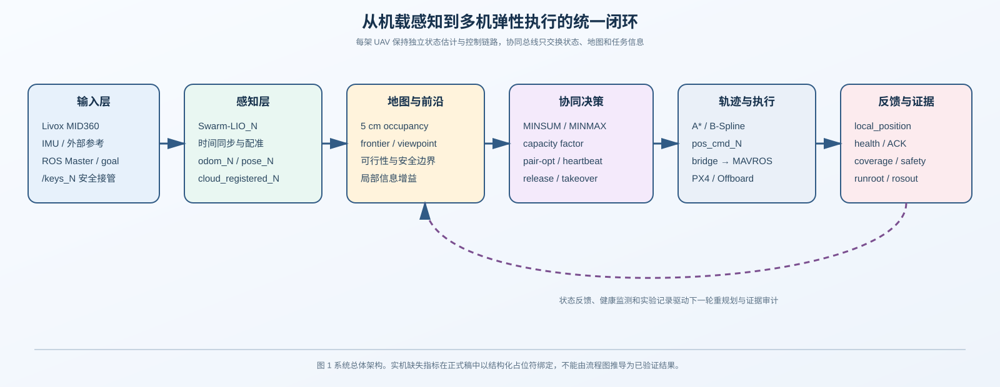
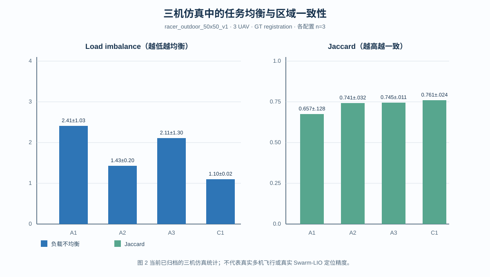
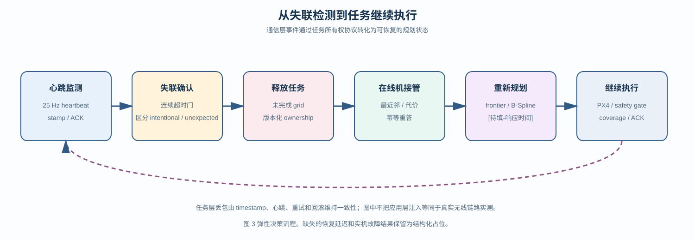

# 基于国产算力的多无人机具身智能实时感知、协同探索与弹性决策系统

**文稿状态**：`DRAFT_NOT_SUBMITTABLE`（结果、文献和部分图表仍需绑定原始证据）  
**项目题目**：XH-202629 基于国产算力的无人机具身智能实时感知与决策系统实现  
**作者/单位**：[待填]  
**版本**：v1，2026-09-08

> 写作说明：本文严格采用《论文框架.docx》的七章顺序。正文不展开日常调试过程、终端命令或逐行日志；缺失实验只保留论文所需的结果槽位。定稿前须将所有 `[待填-...]`、`[待补-...]` 和 `[CITATION_TODO]` 绑定到真实数据或文献。

## 摘要

面向 GNSS 拒止、先验地图不完备和通信状态变化的无人机自主作业，本文构建了一套面向国产边缘算力的多无人机具身智能实时感知与决策系统。系统以激光雷达和惯性传感器为输入，经 Swarm-LIO 完成状态估计与局部地图构建，通过 frontier 探索和 RACER 生成可执行轨迹，并以任务所有权、心跳和接管机制支持多机协同与故障恢复。针对多机任务负载不均衡问题，系统提供 MINSUM 与 MINMAX 两类任务分配目标，并通过容量系数调节单机任务量；针对通信不稳定问题，系统在任务层引入时间戳、幂等应答、周期性心跳和回滚策略。

在当前可追溯的三机仿真矩阵中，MINMAX+0.75 配置的 fleet coverage ratio 为 `0.2258±0.0050`，负载不均衡指标为 `1.10±0.02`，Jaccard 一致性为 `0.7612±0.0237`；任务层 20% 丢包的阶段性报告给出 coverage `0.657`，相对 0% 基线 `0.673` 保持约 `97.6%`。单机实机节点级基线分别获得 UAV1 `34.64 m/0.9288` 和 UAV2 `55.34 m/0.9874` 的轨迹长度/coverage，其中 UAV2 保存了 5 cm PGM。室内多机、AirSim、真实三机 ATE、统一建图频率、在线重规划延迟、整机功耗和完整国产化证明采用结构化结果占位，待统一实验数据归档后绑定。本文的重点不是把尚未绑定的结果写成结论，而是建立从感知、协同到执行的可审计闭环和可重复的实验组织方式。

**关键词**：国产算力；无人机具身智能；Swarm-LIO；frontier exploration；MINMAX 任务分配；任务接管；弹性决策

## 第一章 绪论

### 1.1 项目背景（简洁）

无人机在室内未知空间、灾害现场、地下设施和城市峡谷等环境中执行搜索与建图任务时，往往无法依赖稳定的 GNSS 或完整先验地图。无人机必须从机载传感器中实时恢复自身状态和环境几何，识别仍未探索的区域，并将有限的飞行时间分配给合适的个体。对于多无人机系统，单机能力还要与通信质量、任务所有权和飞控安全约束共同作用：一架无人机失联后，未完成任务不能永久悬置；通信出现短时丢包时，其他无人机也不能因重复认领或状态冲突而停止探索。

国产边缘算力进一步压缩了系统的计算、功耗和接口余量。感知、地图、任务分配、轨迹规划和飞控执行需要在有限资源上形成闭环，系统还要保留人工接管、状态反馈和实验记录能力。系统面对四个相互耦合的工程目标：实时激光—惯性感知、多机未知区域探索、任务分配与负载均衡，以及通信/个体失效下的弹性决策。

本文围绕 XH-202629 赛题要求，搭建从 Livox MID360、IMU 和外部参考输入，到 Swarm-LIO、RACER、MAVROS/PX4 和记录器输出的系统链路。论文首先给出系统总体方案和关键算法，再用三机仿真矩阵分析任务分配与容错机制，最后以单机实机节点级基线和待绑定的多机实机结果槽位说明系统的迁移边界。

### 1.2 研究现状（简洁）

#### 1.2.1 激光—惯性里程计与多机协同定位

激光—惯性里程计通过点云几何和 IMU 运动约束估计平台状态，并在连续帧之间维护局部地图。面向无人机集群的 Swarm-LIO 系列工作引入队友状态、相对观测和全局外参，使多架飞行器能够在分布式架构中共享低维状态信息。本文采用的相关算法原理、消息接口和源码映射以本地归档论文为依据；其余细节将在引用核验后补充为正式文献条目。`[CITATION_TODO: 近期 LIO 与多机协同定位综述]`

#### 1.2.2 Frontier 探索与视点规划

Frontier-based exploration 将已知空间与未知空间的边界作为候选目标，再结合信息增益、路径代价和安全约束生成下一视点。单机方法能够在无先验地图的情况下持续扩大可观测区域，但候选点筛选和轨迹规划需要与实时感知频率匹配。多机系统还要处理重复覆盖、地图异步更新和不同起点造成的任务代价差异。`[CITATION_TODO: frontier exploration 与多机视点规划代表性工作]`

#### 1.2.3 多机任务分配与负载均衡

多机探索可以被抽象为带容量约束的任务分配或多旅行商问题。MINSUM 关注总路径代价，MINMAX 则压低最大单机代价，适合降低最慢个体对整体任务结束时间的支配。实际系统需要在目标函数、容量系数、任务所有权和地图一致性之间折中。`[CITATION_TODO: 多机器人任务分配与 MINMAX/MINSUM 比较]`

#### 1.2.4 通信不稳定与故障弹性

多无人机协同不仅依赖消息能到达，还依赖接收方能够判断消息新旧、重复和所有权冲突。心跳检测、任务释放、幂等应答和接管策略可以把单机掉线从全局故障转化为任务重分配事件。本文将 20% 丢包作为任务层注入条件，讨论其对覆盖和任务连续性的影响；底层无线吞吐、时延和抖动仍需另行测量。`[CITATION_TODO: 分布式容错、心跳和多机器人通信弹性工作]`

### 1.3 项目目标

本文的目标包括：

1. 在国产边缘平台上建立激光—惯性感知、局部建图、frontier 提取、轨迹生成和 PX4 执行的闭环；
2. 将未知区域任务组织为可分配的 frontier/grid，并比较 MINSUM 与 MINMAX 在多机负载均衡上的差异；
3. 通过心跳、任务释放、在线接管、幂等应答和回滚机制，使任务层通信丢包或单机掉线不必然终止整体探索；
4. 建立仿真、单机实机和多机实机的分层实验组织，确保每一个指标都有场景、样本量、数据来源和限制说明。

赛题指标与当前结果的对应关系见表 1。空白单元格不是成功结论，而是定稿前必须绑定的结果接口。

| 赛题指标 | 论文中的测量字段 | 当前状态 |
|---|---|---|
| 室内 ATE RMS ≤0.3 m | ATE RMS、真值来源、时间窗 | `[待填-室内 ATE]` |
| 室外 ATE RMS ≤0.5 m | ATE RMS、场景、样本数 | `[待填-室外 ATE]` |
| 三维地图分辨率 ≥5 cm | voxel/PGM 分辨率、融合地图 | 单机 UAV2 已有 5 cm PGM；fleet `[待填]` |
| 单机定位建图 ≥10 Hz | odom/cloud/pose 频率分布 | `[待填-Hz 统计]` |
| ≤20% 丢包任务不中断 | 丢包层级、coverage、任务状态 | 有任务层仿真阶段性结果 |
| 在线重规划 ≤2 s | 事件到新轨迹生效的 P50/P95 | `[待填-重规划延迟]` |
| 总功耗 ≤30 W | idle/平均/峰值功耗 | `[待填-功耗]` |
| 国产算力与系统 | SoC、OS、BOM、驱动来源 | `[待填-国产化证明]` |

## 第二章 系统总体方案

### 2.1 系统总体架构

系统采用分层闭环结构。输入层接收 Livox MID360 点云、IMU、外部参考和任务触发；感知层由每架无人机独立运行的 Swarm-LIO 产生 odometry、pose 和注册点云；地图层将观测更新为局部 occupancy 和 frontier 候选；协同决策层对任务网格进行分配并处理心跳与接管；执行层将 B-Spline 或位置指令发送给 bridge、MAVROS 和 PX4；反馈层记录 local position、ACK、coverage、运行状态和实验产物。

图 1 采用“逐机状态估计、共享任务状态、独立控制链路”的原则。协同总线不直接替代单机控制，`/cloud_registered_N`、`/lidar_slam/odom_N`、`/planning/pos_cmd_N` 和 `/keys_N` 用于隔离不同个体的观测、规划、指令和安全接管。

### 2.2 硬件平台选择

系统硬件由国产边缘计算平台、Livox MID360、IMU、PX4 飞控和必要的外部参考设备组成。平台选择关注四类约束：一是能否同时承载点云处理、状态估计和规划；二是是否提供传感器、网络和飞控所需接口；三是机载供电、散热和体积是否可接受；四是软件环境能否稳定运行 ROS、驱动和记录器。

| 设备 | 作用 | 当前信息 |
|---|---|---|
| 国产边缘计算平台 | 点云、LIO、规划和通信 | `[待填-SoC/OS/内存]` |
| Livox MID360 | 水平全向激光观测 | 已接入 UAV1/UAV2；三机配置 `[待填]` |
| IMU | 惯性传播与去畸变 | `[待填-型号/频率]` |
| PX4 飞控 | 姿态、位置和安全执行 | `[待填-固件/控制频率]` |
| 外部参考 | 轨迹评估或初始化 | `[待填-动捕/真值配置]` |

功耗采用板级输入端采样，待补记录应包含采样率、传感器清单、空载/感知/规划/峰值阶段和统计窗口。没有完整采样前，本文不填写 ≤30 W 的达成结论。

### 2.3 软件与算法框架选择

软件栈由 ROS 通信层、Swarm-LIO 感知层、RACER 探索规划层、MAVROS/PX4 执行层和 recorder 证据层组成。Swarm-LIO 负责把点云与 IMU 转换为可用于地图和规划的状态；RACER 从 occupancy/frontier 生成候选、任务和轨迹；bridge 将规划输出转换为飞控可接受的指令，并保留人工接管；recorder 将每个阶段的状态和指标与实验 ID 绑定。

双机话题流图见现有 Archify 资产 `topic_flow_dual_real.html`；论文版图只保留输入、状态估计、协同交换、执行和反馈五类语义。三机扩展沿用相同契约，以 `N=1,2,3` 替换实例编号，避免共享触发误写成共享控制。

## 第三章 关键技术

### 3.1 Swarm-LIO 算法原理

Swarm-LIO 的单机前端接收时间同步后的点云和 IMU，先通过惯性传播获得状态先验，再用点云几何约束更新姿态、位置和局部地图。多机模式在每个节点保留自身状态估计，同时交换队友状态、相对观测或外参信息。该结构把高维点云处理保留在本机，把必要的协同信息压缩为可在有限带宽上传输的状态量。

设单机状态为 
\[
\mathbf{x}_k=[\mathbf{R}_k,\mathbf{p}_k,\mathbf{v}_k,\mathbf{b}^{g}_k,\mathbf{b}^{a}_k],
\]
其中 \(\mathbf{R}\)、\(\mathbf{p}\)、\(\mathbf{v}\) 分别表示姿态、位置和速度，\(\mathbf{b}^{g}\)、\(\mathbf{b}^{a}\) 为陀螺和加速度计偏置。IMU 提供状态传播，点云匹配提供几何残差，队友观测则提供跨节点的相对约束。具体噪声模型、残差形式和源码版本对应关系需在引用和版本核验后补入：`[待补-公式与当前 overlay 的逐项映射]`。

在本项目中，LIO 输出 `/lidar_slam/odom_N`、`/lidar_slam/pose_N` 和 `/cloud_registered_N`，探索层据此更新 occupancy 与 frontier。仿真矩阵中的 `registration_source=gt` 只用于隔离任务分配和容错机制；它不替代真实 Swarm-LIO 误差测量。

### 3.2 RACER 与单机优化

RACER 将地图中的未知—已知边界提取为 frontier 候选，再根据可达性、信息增益、路径长度和安全距离生成视点。规划器首先检查当前位置和目标是否落在有效边界内，再通过搜索得到离散路径，并由轨迹优化器生成时间参数化 B-Spline。执行过程中，frontier 更新、地图变化和障碍物事件都可以触发重新规划。

单机优化围绕边缘平台上的稳定运行展开：当短时间内没有新的 frontier 时周期性复查；当候选路径失效时保留重试和回退；当状态变化时从当前 odometry 重新生成局部规划；当轨迹接近边界或安全距离不足时拒绝执行。上述机制描述系统设计，不等价于某次长时间飞行已满足固定时延或零冻结指标。

### 3.3 自适应弹性决策（20%丢包率、单机掉线、在线重规划）

系统把协同任务状态表示为带版本和时间戳的 ownership。正常情况下，节点通过心跳共享在线状态和任务进度；当一个节点连续超过确认窗口未更新，系统释放其未完成任务，再由在线节点按距离和任务代价接管。接管后，局部地图和 frontier 重新进入规划循环，避免把单机故障传播为全局停止。

任务层丢包通过 `sim_drop_rate` 注入，协议侧使用时间戳判断新旧消息，对相同版本的重复请求执行幂等重答，并以周期性 heartbeat 和异常回滚减少永久冲突。该注入用于验证任务协议，不代表真实无线链路的吞吐、时延、抖动或物理丢包率。

在线重规划时间定义为“故障/障碍事件时间戳”到“新轨迹首次生效时间戳”的差值，报告 P50、P95 和最大值：`[待填-重规划响应：P50=；P95=；max=；n=；事件类型=]`。

## 第四章 仿真实验结果

### 4.1 实验设置

#### 4.1.1 室内三机、六机和十机

室内实验统一记录场景尺寸、障碍布局、机载传感器、真值来源、地图分辨率、飞行高度、速度、重复次数和安全事件。当前正式材料缺少与论文框架完全对应的室内三机、六机和十机 runroot，待补字段如下：

| 场景 | 无人机数 | 世界/障碍 | 真值来源 | 时长 | 重复次数 | 状态 |
|---|---:|---|---|---:|---:|---|
| 室内小场景 | 3 | `[待填]` | `[待填]` | `[待填]` | `[待填]` | `[待补]` |
| 室内小场景 | 6 | `[待填]` | `[待填]` | `[待填]` | `[待填]` | `[待补]` |
| 室内小场景 | 10 | `[待填]` | `[待填]` | `[待填]` | `[待填]` | `[待补]` |

#### 4.1.2 当前可追溯的三机代理矩阵

当前最完整的矩阵使用 Gazebo、PX4 SITL、RACER 和 `racer_outdoor_50x50_v1`，场景尺寸为 50 m×50 m，3 架无人机，异步共享地图，规划分辨率 0.05 m，并以 GT registration 隔离任务分配和容错因素。A1/A2/A3 为无掉线配置，B1/B2/B3 为掉线配置，C1 为 MINMAX+0.75 重复基线，共 21 次运行。由于跨机注册采用仿真真值，结果不能直接解释为真实 Swarm-LIO 定位精度。

#### 4.1.3 室外 AirSim

AirSim 结果表预留场景、传感器、飞行时长、轨迹、coverage、ATE、重规划和安全字段：`[待填-AirSim 实验设置]`。只有完成 RACER/ROS/PX4 闭环并保存轨迹后，才能填写本节。

### 4.2 仿真实验结果

#### 4.2.1 单机基线

阶段报告记录的单机仿真基线为 60.20 simulated s、coverage 0.7294、ATE RMSE 0.0802 m、轨迹 P10 clearance 1.898 m，crash、freeze、contact、ACK timeout 和 segmentation fault 均为 0。由于当前工作区尚未将该阶段报告与完整正式 runroot 一一绑定，本文把它标为 report-level-sim，定稿时补充 run ID 和真值口径。

#### 4.2.2 三机任务分配矩阵

表 2 汇总当前可追溯的三机仿真矩阵。fleet coverage ratio 的分母、地图一致性和路径统计以原始矩阵报告定义为准。

| 组别 | 配置 | fleet coverage ratio | total path (m) | load imbalance | Jaccard | overlap |
|---|---|---:|---:|---:|---:|---:|
| A1 | MINSUM，capacity 0.75 | 0.205±0.025 | 557±174 | 2.41±1.03 | 0.657±0.128 | 0.902±0.030 |
| A2 | MINMAX，capacity 0.75 | 0.224±0.007 | 796±88 | 1.43±0.20 | 0.741±0.032 | 0.898±0.015 |
| A3 | MINMAX，capacity 0.50 | 0.213±0.009 | 709±109 | 2.11±1.30 | 0.745±0.011 | 0.877±0.014 |
| B1 | MINSUM，capacity 0.75，掉线 | 0.201±0.019 | 503±55 | 7.36±1.28 | 0.141±0.037 | 0.893±0.028 |
| B2 | MINMAX，capacity 0.75，掉线 | 0.207±0.008 | 562±34 | 9.08±3.38 | 0.080±0.009 | 0.911±0.008 |
| B3 | MINMAX，capacity 0.50，掉线 | 0.185±0.023 | 427±72 | 6.41±2.65 | 0.260±0.189 | 0.897±0.026 |
| C1 | MINMAX+0.75 重复基线 | 0.2258±0.0050 | 819±143 | 1.10±0.02 | 0.7612±0.0237 | 0.8939±0.0127 |

从当前代理场景看，C1 的负载不均衡和区域一致性波动较小；A2 相比 A1 降低了负载不均衡，但总路径代价更高。该现象体现了“总路径—最慢个体—区域一致性”之间的折中，不构成对任意场景的全局最优性证明。

#### 4.2.3 掉线与 20% 任务层丢包

阶段性报告给出 300 s 级任务层对照：0% 基线 coverage 为 0.673，20% 丢包注入 coverage 为 0.657，比例约为 97.6%，并观察到任务释放、在线接管和任务继续推进。由于对应 300 s 原始 runroot 尚未完整定位，本文把该数字标为 report-level-sim；短时可定位检查不替代该报告结果。正式稿需绑定注入计数、消息总数、任务版本、丢弃数和恢复时间。

#### 4.2.4 室内六/十机与 AirSim

| 场景 | coverage | ATE RMS | 规划 P95 | 最小间距 | contact/crash | 状态 |
|---|---:|---:|---:|---:|---|---|
| 室内三机 | `[待填]` | `[待填]` | `[待填]` | `[待填]` | `[待填]` | `[待补]` |
| 室内六机 | `[待填]` | `[待填]` | `[待填]` | `[待填]` | `[待填]` | `[待补]` |
| 室内十机 | `[待填]` | `[待填]` | `[待填]` | `[待填]` | `[待填]` | `[待补]` |
| 室外 AirSim | `[待填]` | `[待填]` | `[待填]` | `[待填]` | `[待填]` | `[待补]` |

### 4.3 仿真实验总结

三机代理矩阵支持在固定场景和 GT registration 条件下比较任务分配目标，并观察到 MINMAX+0.75 在当前配置中的负载均衡优势。掉线与任务层丢包实验说明，版本化任务所有权、释放和接管机制可以作为连续探索的组织方式。室内多规模和 AirSim 部分保留同样的指标接口，待实验归档后填入统一表格。仿真结果不直接替代真实传感器误差、无线链路和机载功耗测量。

## 第五章 实机实验结果

### 5.1 实验设置（实机实验环境，室内单机+三机）

实机平台由国产边缘计算节点、Livox MID360、IMU、PX4 飞控和 ROS 软件栈组成。单机实验用于验证传感器、状态估计、地图和规划链路；三机实验在相同命名空间和安全门规则下增加协同状态、任务分配和独立控制链。正式记录需同时保存启动 manifest、源码 hash、参数快照、每机 runroot、轨迹、local_position、飞控状态、功耗和视频编号。

| 项目 | 单机 | 三机 | 当前定稿字段 |
|---|---|---|---|
| 场地与障碍 | `[待填]` | `[待填]` | `[待填-场地尺寸/障碍]` |
| 飞行高度/速度 | `[待填]` | `[待填]` | `[待填]` |
| LIO/地图分辨率 | `[待填]` | `[待填]` | UAV2 有 5 cm PGM；fleet `[待填]` |
| 记录和真值 | `[待填]` | `[待填]` | `[待填-时间对齐/视频]` |
| 安全门 | `[待填]` | `[待填]` | `[待填-armed/hover/RC]` |

### 5.2 实机实验结果（单机+三机）

#### 5.2.1 单机节点级基线

当前可引用的单机实机 baseline 如表 3。指标用于说明节点级链路能够产出轨迹和地图，不外推为多机融合精度或赛题全部指标。

| 节点 | 轨迹长度 | coverage | cloud/occupancy | 地图 | 证据层级 |
|---|---:|---:|---:|---|---|
| UAV1 | 34.64 m | 0.9288 | `[地图字段待补]` | `[待补]` | verified-node-real |
| UAV2 | 55.34 m | 0.9874 | 4908 / 5800 | 5 cm PGM | verified-node-real |

图 4 的图注在定稿时补充 run ID、坐标系、采样时间和绘图脚本；不同单机实验的时长、停止时刻和地图保存条件不同，不能直接比较飞行速度。

#### 5.2.2 三机实机结果

三机结果表按照成功闭环实验的论文格式预留。每个数值必须来自同一场景、同一 run ID 和统一时间窗；空白单元格不推断为零，也不推断为成功。

| Run | ATE RMS (m) | 建图频率 (Hz) | 地图分辨率 (cm) | coverage | 最小间距 (m) | 重规划 P95 (s) | 功耗 (W) | 完成状态 |
|---|---:|---:|---:|---:|---:|---:|---:|---|
| 三机-1 | `[待填]` | `[待填]` | `[待填]` | `[待填]` | `[待填]` | `[待填]` | `[待填]` | `[待填]` |
| 三机-2 | `[待填]` | `[待填]` | `[待填]` | `[待填]` | `[待填]` | `[待填]` | `[待填]` | `[待填]` |
| 三机-3 | `[待填]` | `[待填]` | `[待填]` | `[待填]` | `[待填]` | `[待填]` | `[待填]` | `[待填]` |

图 5 当前仅为结果位，待三机轨迹、融合地图和统计文件绑定后替换为实机图；不得用系统流程图冒充实机结果。

### 5.3 实机实验结果总结

单机节点级实验已经形成轨迹、coverage、点云和 PGM 等产物，说明感知—规划—记录链具备继续开展多机实验的基础。三机实机部分需要以统一 runroot 绑定 ATE、频率、地图、最小间距、重规划、功耗和视频，之后才能形成与赛题指标一一对应的结论。本文把这些字段保留为结果接口，而不是以结构完整替代数据完整。

## 第六章 应用创新

### 6.1 单机探索机制创新（防冻结、改出徘徊、轨迹安全测试）

边缘平台上的探索器需要处理感知更新不连续、frontier 短时消失和局部路径不可行等情况。本文将周期性 frontier 复查、从当前状态软重规划、失败重试/回退和安全边界检查组合成轻量恢复机制。与单一“无 frontier 即结束”的策略相比，这些机制为短暂感知空窗和地图变化留下恢复机会。

改前/改后对照采用同一场景、相同随机种子和相同安全门。定稿表格如下：

| 指标 | 未启用恢复机制 | 启用恢复机制 | 改善方向 |
|---|---:|---:|---|
| 任务完成率 | `[待填]` | `[待填]` | `[待填]` |
| 冻结时长 P95 (s) | `[待填]` | `[待填]` | `[待填]` |
| 轨迹最小净空 (m) | `[待填]` | `[待填]` | `[待填]` |
| 重规划成功率 | `[待填]` | `[待填]` | `[待填]` |

### 6.2 多机任务分配（MINMAX）

设任务集合为 \(G\)，无人机集合为 \(U\)，每个任务由一个在线无人机拥有。MINSUM 目标最小化各机任务路径代价总和；MINMAX 目标最小化最大单机代价：

\[
J_{\mathrm{sum}}=\sum_{u\in U} L_u,\qquad
J_{\mathrm{max}}=\max_{u\in U} L_u.
\]

容量系数用于限制单机可以承担的任务规模，pair-opt 用于在局部状态变化时协调任务归属。当前三机矩阵显示，A2 的 MINMAX+0.75 负载不均衡为 `1.43±0.20`，C1 重复基线为 `1.10±0.02`；相应总路径代价高于部分 MINSUM 配置。本文将其表述为当前代理场景下的工程折中，不主张理论最优性。

### 6.3 自适应决策创新（20%丢包率与单机掉线机制）

自适应决策把通信事件转化为任务事件：心跳超时触发失联确认，未完成任务进入可回收状态，在线节点按照任务代价和距离接管，随后重新规划。对 20% 任务层丢包，时间戳和幂等应答防止旧消息覆盖新所有权，周期性 heartbeat 使状态可以重新收敛，回滚机制避免异常版本永久占有任务。

当前阶段性报告给出 0%/20% coverage `0.673/0.657` 的对照，保持约 `97.6%`；完整消息计数、接管延迟和底层无线指标留待补测。该创新的论文贡献是协议组合和可审计验证方法，而不是未经对照的普适最优性。

## 第七章 总结与展望

### 7.1 项目总结（指标达成表）

本文构建了面向国产边缘算力的多无人机感知—探索—决策—执行系统，组合 Swarm-LIO、RACER、MINMAX 任务分配和弹性任务协议。三机仿真矩阵验证了在固定代理场景中比较任务均衡策略的可行性；单机实机 baseline 形成了轨迹、点云和 PGM 产物；多机实机结果、部分赛题指标和国产化证明采用统一结果表保留接口。

| 指标 | 目标 | 当前可填结果 | 证据层级 | 定稿动作 |
|---|---:|---:|---|---|
| 室内 ATE RMS | ≤0.3 m | `[待填]` | `[待填]` | 绑定真值与时间对齐 |
| 室外 ATE RMS | ≤0.5 m | `[待填]` | `[待填]` | 绑定室外实验 |
| 地图分辨率 | ≥5 cm | UAV2 5 cm PGM；fleet `[待填]` | verified-node-real/待补 | 保存融合地图元数据 |
| 单机频率 | ≥10 Hz | `[待填]` | `[待填]` | 统计 cloud/odom/pose |
| 丢包任务连续性 | ≤20% | 仿真 coverage 0.657 vs 0.673 | report-level-sim | 绑定 300 s runroot |
| 重规划响应 | ≤2 s | `[待填]` | missing | 记录事件和轨迹时间戳 |
| 总功耗 | ≤30 W | `[待填]` | missing | 板级采样 |
| 多机实机 | 3 UAV | `[待填]` | missing | 三机统一 runroot |

因此，本文当前版本应被理解为“系统论文初稿和结果接口”，而不是已经完成全部赛题指标的最终成绩报告。定稿前需要完成结果、文献、图表和指标证据的绑定，并重新执行 claim、citation 和结果一致性检查。

### 7.2 项目展望（外场实验+应用前景）

下一阶段首先补齐三机硬件、场地和统一实验 manifest，随后按单机、双机、三机逐级通过传感器连续性、外部视觉、local position、任务 ownership、pair-opt、hover gate 和记录完整性检查。实验需要同时输出 ATE、地图分辨率、LIO/地图频率、重规划 P95、最小间距、功耗、丢包/掉线标签和视频编号。

在完成室内多规模和 AirSim 闭环后，系统可以面向未知空间搜索、灾害现场快速建图、地下/峡谷巡检、仓储和大型设施巡检。多机协同能够缩短覆盖时间，并在个体失效时维持任务连续性；国产边缘平台有望降低对高功耗外部计算节点的依赖。上述应用前景以补齐真实指标和安全验证为前提，不把设计目标倒写成已经部署的结论。

## 参考文献（待核验）

[1] Zhu, Fangcheng, et al. “Swarm-LIO2: Decentralized Efficient LiDAR-Inertial Odometry for Aerial Swarm Systems.” *IEEE Transactions on Robotics*, 2025. DOI: `10.1109/TRO.2024.3522155`. `[待 verify-citations]`

[2] Zhu, Fangcheng, et al. “Swarm-LIO: Decentralized Swarm LiDAR-Inertial Odometry.” *ICRA*, 2023. `[待 verify-citations]`

[3] `[CITATION_TODO: frontier-based exploration 代表性论文]`

[4] `[CITATION_TODO: 多机器人任务分配/MINMAX 代表性论文]`

[5] `[CITATION_TODO: 多机器人通信容错/任务接管代表性论文]`

[6] `[CITATION_TODO: 国产边缘算力或机载实时部署研究]`
