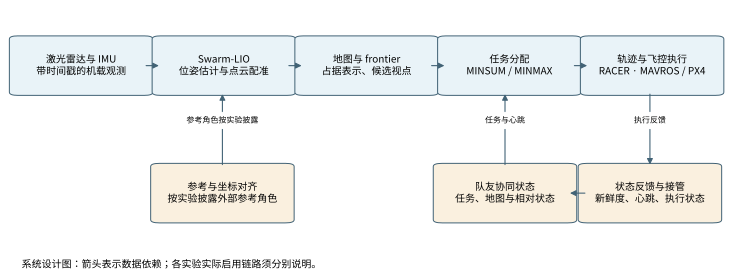
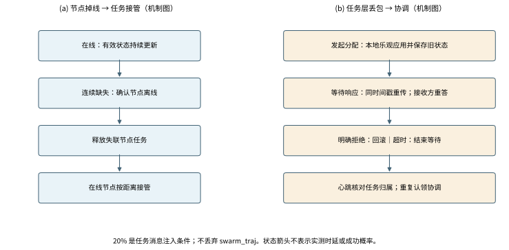
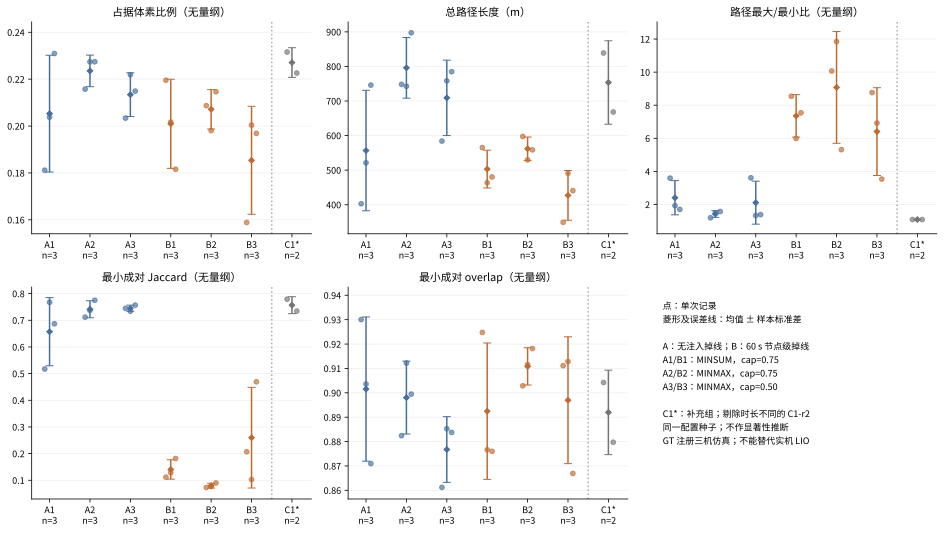
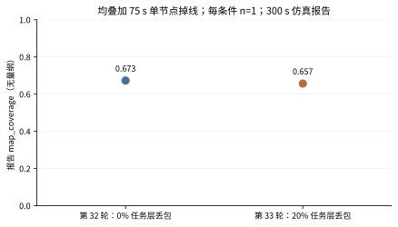
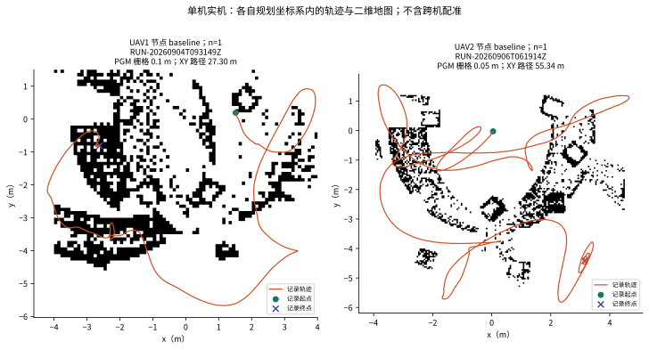
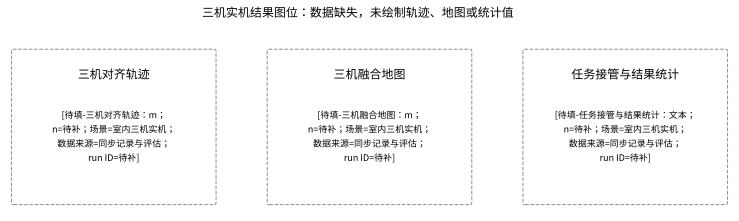

# 面向国产算力的多无人机具身智能感知与弹性探索系统

版本：v2，2026-09-08。稿件状态：`DRAFT_NOT_SUBMITTABLE`。本文为证据约束下的完整结构稿，方括号内为尚待补齐的结果接口。

作者及单位：[待填-作者与单位：文本；n=待补；场景=投稿署名；数据来源=作者确认；run ID=不适用]

**摘要**　未知空间中的多无人机自主探索需要同时处理位姿估计、环境建图、任务分配和节点失联。面向机载计算资源受限的应用条件，本文组织了一套由激光惯性估计、层次探索规划和任务状态协调组成的系统方案，并在现有探索框架上研究分配目标与故障恢复接口。仿真评估将总成本目标 MINSUM、最大负载目标 MINMAX 和容量约束分开比较，实机评估以单节点轨迹及地图产物为基础。在采用真值注册的三机代理场景中，六个主比较组各保留 3 次记录；无掉线条件下，MINMAX、容量系数 0.75 组的占据体素比例为 0.2235 ± 0.0067，路径最大/最小比为 1.4249 ± 0.2011，对应 MINSUM 组分别为 0.2053 ± 0.0249 和 2.4089 ± 1.0324。上述变化伴随总路径增加，不能解释为全面效率优势。任务层 20% 丢包与节点掉线的组合条件仅有报告级仿真证据，单机实机产物也不构成三机协同验证。本文明确给出感知精度、更新频率、重规划时延、平台功耗和国产化材料的测量接口，为后续统一场景验收提供可追溯的论文结构。

**关键词**　多无人机；激光惯性里程计；自主探索；任务分配；故障恢复；机载计算

## 第一章：绪论

### 1.1 项目背景（简洁）

在卫星定位受限、先验地图缺失的室内搜索与设施巡检中，无人机需要从机载观测中估计运动状态，并持续选择有信息增益的探索方向。地图随运动逐步形成，路径安全与下一步目标因而依赖同一套时变环境表示。仅完成定位或生成一条可行轨迹，都不足以说明系统能够持续执行探索任务。

多机协作进一步引入任务归属和状态一致性问题。各节点看到的地图范围不同，消息存在延迟或丢失，局部合理的选择可能造成重复搜索或负载集中。节点退出后，原有任务还需要交由剩余节点处理。国产机载计算平台上的系统需要协调感知、决策与执行，并分别测量算法效果、任务连续性和资源开销。

### 1.2 研究现状（简洁）

激光惯性里程计利用惯性测量提供短时运动预测，再用几何观测约束漂移。FAST-LIO2 以直接点云配准和增量地图结构降低估计开销，原论文也讨论了不同计算平台上的运行表现[1]。Swarm-LIO 将机间相互观测引入分布式估计[2]，Swarm-LIO2 进一步面向无人机集群处理初始化、状态估计和计算效率[3]。这些研究提供了感知基础，但其公开性能不能直接作为本地硬件和场景的测量结果。

在探索规划方面，frontier 方法以已知自由空间与未知区域的边界引导搜索[4]。FUEL 将增量 frontier 表示、访问顺序和局部轨迹规划结合起来[5]；RACER 在此类层次规划思想上组织去中心化多机协作，以层次网格和成对优化降低协同开销，并考虑任务负载[6]。因此，本文不把“采用 frontier”或“引入负载均衡”作为首次提出的算法，而是考察既有探索体系中目标函数、容量约束与任务恢复机制的工程取舍。

任务分配与故障恢复也有不同的研究侧重。CBBA 通过拍卖和一致性过程协调任务冲突，其收敛结论依赖明确假设[7]。Best 等将多传感器探索与行为组织结合，用于复杂环境中的多机任务执行[8]。本文的时间戳重传、任务释放和心跳核对属于具体协议实现，其端到端时延与可靠性仍须在本系统中测量，不能沿用其他方法的理论保证。机载计算方面，现有文献可支持高效估计的设计动机[1,3]，完整国产化与平台功耗则需要本项目的器件、软件和供电证据。

**表 1　相关研究与本文关系。** 表中比较方法对象，不作跨论文性能排名。

| 研究方向 | 代表工作 | 本文采用或考察的接口 | 本文证据范围 |
|---|---|---|---|
| 激光惯性与协同估计 | FAST-LIO2、Swarm-LIO、Swarm-LIO2[1–3] | 位姿、配准点云、机间参考关系 | 算法依据与节点产物；协同精度待测 |
| frontier 与层次规划 | Yamauchi、FUEL[4,5] | 候选视点、访问顺序、连续轨迹 | 继承规划思想；恢复策略需独立消融 |
| 去中心化分配 | RACER、CBBA[6,7] | 任务归属、成对协商、负载目标 | 固定三机仿真条件下的目标比较 |
| 弹性任务执行 | Best 等、CBBA[8,7] | 状态协调、任务释放与接管 | 故障注入和任务层丢包，未证明通用容错 |
| 机载计算 | FAST-LIO2、Swarm-LIO2[1,3] | 估计开销与平台测量边界 | 不继承文献功耗或国产化结论 |

### 1.3 项目目标

项目目标是形成可解释、可测量的感知—探索—执行系统：每架无人机维持本地估计与规划，在线节点协商任务归属，发生状态缺失时进行任务协调。本文的系统性贡献包括逐机接口组织、分配目标与容量约束的对照分析，以及任务层故障恢复机制的证据分层。三项内容分别由第二、三章阐明，并在第四、五章给出当前可用结果。

**表 2　赛题需求及测量对象。** 阈值来自所给比赛方案第 6 页，是验收目标，不是本文实测值。

| 需求 | 赛题要求 | 本文测量对象与位置 |
|---|---|---|
| 定位误差 | 室内 ≤0.3 m RMS；室外 ≤0.5 m RMS | 对齐规则固定后的 ATE，4.2、5.2 |
| 地图 | 原文“分辨率不低于5厘米” | 保留原文；栅格间距与重建精度的验收语义待确认，5.2 |
| 实时性 | 单机定位与建图更新频率 ≥10 Hz | 同一有效任务窗口内分别测量定位和地图输出，7.1 |
| 通信适应性 | ≤20% 链路间歇丢包时核心任务持续 | 区分任务消息注入与完整无线链路，3.3、4.2 |
| 在线重规划 | 响应不超过 2 s | 从约定触发事件至新轨迹可执行的端到端时延，3.3 |
| 功耗 | 单机机载计算平台总功耗 ≤30 W | 规定供电边界后的平台功率时间序列，7.1 |
| 国产化 | 对完整国产化材料进行评价 | 芯片、系统、框架及适配证据，2.2、7.1 |

## 第二章：系统总体方案

### 2.1 系统总体架构

系统沿观测、估计、环境表示、任务选择和轨迹执行建立逐机处理链。激光雷达与 IMU 提供带时间戳的观测，估计模块输出位姿及配准点云，地图模块形成可供碰撞检查与 frontier 提取使用的空间表示。探索模块根据自身位置和已分配任务生成目标，轨迹模块将目标转为满足约束的运动指令。飞行状态和地图进展再返回决策模块，决定继续执行、重新选点或等待有效输入。

协同接口交换队友状态、任务认领和必要地图信息。外部参考的用途应按实验说明：用于坐标初始化、持续状态输入和独立评估是不同角色。采用真值注册的仿真结果只回答规划与协同问题，不评估实际激光惯性估计误差。

**图 1　系统总体流程。** 根据已有 SVG 的分层语义及 Archify 数据流资产重绘；箭头为设计依赖，非实机验证标记。[交互视图](../figures/v2/fig01_system_flow.html)。参考输入是否启用、启用方式以及实际数据路径须与具体实验绑定。

**表 3　主要数据接口与测量语义。**

| 接口 | 输入与输出 | 有效性条件 | 需要记录的测量 |
|---|---|---|---|
| 状态估计 | 点云、惯性观测 → 位姿及配准点云 | 时间、坐标与外参一致 | 估计误差、更新间隔 |
| 地图与 frontier | 配准点云、位姿 → 占据表示及候选视点 | 分辨率、边界和未知区域定义固定 | 地图更新间隔、覆盖分母 |
| 任务分配 | 在线节点、任务与代价 → 归属及访问路线 | 消息新鲜度和归属一致性 | 分配时延、负载、冲突 |
| 执行与恢复 | 轨迹、飞行状态 → 执行反馈及恢复事件 | 状态有效、轨迹通过安全检查 | 任务进展、接触、重规划时延 |

### 2.2 硬件平台选择

当前单机实机资料涉及 Khadas 机载节点、激光/惯性观测和飞控执行链。选型应满足传感器时间同步、估计算法的内存与计算需求，以及与飞控通信的稳定性。平台名称可以描述已有集成基础，但不能替代芯片型号、操作系统版本或国产化证明。

**表 4　硬件平台与待补材料。**

| 部件 | 当前用途 | 尚缺的可核验信息 |
|---|---|---|
| 机载计算节点 | Khadas 节点承担感知与规划 | [待填-SoC与内存配置：文本；n=待补；场景=单机实机平台；数据来源=器件清单与设备记录；run ID=待补] |
| LiDAR/IMU | 提供几何与惯性观测 | [待填-传感器型号与同步误差：型号及ms；n=待补；场景=实机感知；数据来源=标定与器件资料；run ID=待补] |
| 飞控与参考系统 | 接收轨迹并提供执行状态；参考用途需披露 | [待填-飞控配置与外部参考角色：文本；n=待补；场景=实机执行；数据来源=配置与实验设计；run ID=待补] |
| 第三架节点 | 三机系统设计接口 | [待填-第三架完整配置：文本；n=待补；场景=室内三机实机；数据来源=硬件与软件清单；run ID=待补] |
| 电源及软件环境 | 支持平台运行与功率测量 | [待填-供电边界及OS框架版本：文本；n=待补；场景=国产机载计算平台；数据来源=供电图与版本材料；run ID=待补] |

平台功耗应以机载计算平台的约定供电边界测量；电机推进功率不能与计算平台功率混用，传感器及通信设备是否纳入边界需在验收前统一。完整国产化材料还应逐项覆盖芯片、操作系统、框架和适配依赖。

### 2.3 软件与算法框架选择

感知部分以 Swarm-LIO 系列为方法依据，探索部分继承 RACER 的层次表示与局部协商思想，轨迹通过飞控接口执行。不同实验使用的输入层级需显式区分：三机矩阵采用 GT 注册代理链路，单机实机保存本地里程计轨迹与地图产物，三机实机尚无可用于成功结论的完整记录。

**表 5　软件层及本文增量。**

| 层次 | 继承基础 | 本文组织的增量 | 当前验证边界 |
|---|---|---|---|
| 估计与建图 | Swarm-LIO 系列[2,3] | 逐机输入、坐标与地图接口 | 不声称提出新的 LIO 估计器 |
| 探索与分配 | FUEL、RACER[5,6] | MINSUM/MINMAX 与容量系数对照 | 固定场景、配置和重复次数 |
| 任务协议 | 现有成对优化与状态交换 | 时间戳重答、拒绝回滚、心跳协调 | 不转用其他协议的收敛证明 |
| 运动恢复 | 现有轨迹和状态机 | 进展检查、目标替换、安全检查接口 | 需要独立消融与实机验证 |

## 第三章：关键技术

### 3.1 swarm-lio算法原理

激光惯性估计通常以位置、速度、姿态、惯性偏置和重力等量描述本机状态，先利用 IMU 在相邻激光观测之间传播状态，再构造点云与局部地图的几何残差进行校正[1]。例如，点到平面残差可写为

\[
r_k=\mathbf n_k^\mathsf T(\mathbf R\mathbf p_k+\mathbf t-\mathbf q_k),
\]

其中，\(\mathbf p_k\) 为经外参变换后的观测点，\(\mathbf q_k\) 与 \(\mathbf n_k\) 表示地图局部平面的位置及法向。该式只说明几何约束的来源，完整估计还需要处理运动畸变、测量噪声和时间关系。

Swarm-LIO 在本机观测之外利用机间相互观测，约束节点间的相对关系[2]。Swarm-LIO2 进一步考虑去中心化初始化、状态传播与计算效率，并通过相应状态管理和边缘化处理维持可用估计[3]。这类方法不等于每架机持续保存全部队友的完整历史状态；描述具体部署时应以启用的状态、消息和参考变换为准。

评价时需要区分算法原理与实际输入。第四章的 GT 注册仿真直接提供规划所需的几何参考，用于比较探索和分配，不能据此报告 Swarm-LIO 的 ATE。第五章的轨迹与地图可以说明单节点产物的存在，定位精度仍需同步参考轨迹、时间对齐、空间对齐和评价窗口。没有独立参考时，轨迹形状与回到起点的视觉观感都不能替代精度测量。

### 3.2 Racer与单机优化

RACER 通过层次网格组织探索区域，并在多节点之间执行局部任务协商；局部规划再从任务对应的 frontier 选择视点和轨迹[6]。本文沿用这一层次关系，把任务归属与连续运动分开：前者决定谁访问哪些区域，后者决定当前怎样安全到达目标。

**目标与容量约束。** 设在线节点集合为 \(\mathcal A\)，待分配任务为 \(\mathcal T\)，分配给节点 \(i\) 的访问路线为 \(\pi_i\)，其规划代价为 \(C_i(\pi_i)\)。在相同任务唯一归属及可行性约束下，两种目标分别为

\[
\text{MINSUM}:\min_{\{\pi_i\}}\sum_{i\in\mathcal A}C_i(\pi_i),\qquad
\text{MINMAX}:\min_{\{\pi_i\}}\max_{i\in\mathcal A}C_i(\pi_i).
\]

前者压低总分配代价，后者限制最重节点的规划负担。容量系数是现有求解配置中的任务容量控制量，本文比较 0.75 与 0.50；它不是电池剩余比例，也不是承诺每机获得固定百分比任务。上述表达概括优化目标，不声称实际启发式求解器取得全局最优。分配代价与执行后的路径长度也不同，后者还受局部可行性、视点选择和恢复动作影响。

**单机持续探索。** 恢复接口围绕“目标是否仍有价值”和“轨迹是否持续带来进展”组织。进展检查同时考虑运动、剩余路径及 frontier 状态，避免把等待有效观测、合法低速运动或任务完成误判为冻结。目标连续失效时，应重新评估候选视点并保留安全约束；重复到访同一区域则需要结合目标历史检查，而不能仅凭曲线形状认定徘徊。

这些接口与轨迹碰撞检查承担不同职责。恢复策略决定何时换目标，安全检查决定候选轨迹能否执行。当前主矩阵归档配置未启用进展保护和全局轨迹保护，因此第四章目标函数对照不能证明这些恢复机制带来收益。其消融指标应包含无进展时长、重复访问、到达率和安全事件，缺失结果见第六章。

### 3.3 自适应弹性决策（20%丢包率与单机掉线，在线重规划响应不超过2s？）

**节点失联与任务释放。** 任务层使用带时间戳的节点状态判断信息新鲜度。当前实现以 5 s 周期检查状态，并在连续两次缺失后确认离线，随后释放失联节点的任务，由在线节点按任务中心的距离选择接管者。这里的故障是显式注入的节点退出，不能与碰撞、坠机或观测缺失混记。该检测机制也说明，从最初状态丢失开始计时的总响应不能由一次局部求解耗时替代。

**成对协商与消息丢失。** 发起者保存旧归属后先在本地应用新分配，在等待期内使用同一时间戳重传。接收者对重复请求重答已有结果，过旧状态不覆盖较新状态。收到明确拒绝时发起者回滚；超时则停止等待并保留乐观归属，由后续心跳协调，不能描述成“任何超时均自动回滚”。重复认领时，现有规则由编号较小节点保留任务，另一个节点释放。该规则降低部分冲突，但其全局收敛时间与重入行为尚无完整测量。

当前任务状态发送周期配置为 0.04 s，重试间隔为 0.2 s，等待超时为 1.5 s。这些量是协议参数，不是实测消息频率、地图更新频率或端到端重规划时延。任务层注入作用于成对请求、成对响应及节点状态消息，不作用于 `swarm_traj` 轨迹消息。因此，20% 注入实验的外推范围限于上述任务消息，不能等同于完整无线链路以相同比例丢包。

**图 2　掉线与 20% 任务层丢包的状态处理。** 机制示意图，无实测时间轴或概率曲线。明确拒绝、等待超时和节点离线分别触发不同处理。

**响应时间定义。** 以故障或任务变化发生的时刻 \(t_0\) 为起点，依次记录检测完成、分配完成、新轨迹可用和执行开始时刻。若验收终点规定为轨迹可执行，则端到端响应为 \(T_{\mathrm{resp}}=t_{\mathrm{ready}}-t_0\)；若要求执行实际开始，还应包含下发和控制接收时间。两种口径应事先选定，不能在结果产生后切换。验证“不超过 2 s”需要逐事件上界检查和最大值；仅报告 P95 无法证明全部事件满足上限。

当前结果：[待填-端到端重规划响应最大值及分位数：s；n=待补；场景=任务变化与节点掉线分开统计；数据来源=同步事件时间戳；run ID=待补]。多维健康判断与安全等待可作为后续扩展，尚不能写成全条件验证的自适应策略。

## 第四章：仿真实验结果

### 4.1 实验设置（仿真环境，室内三机+室内六/十机+室外airsim）

实验设计按单机方法检查、三机协同、规模扩展和跨仿真器验证分层。当前可计算的主结果来自 Gazebo Classic/PX4 SITL 的三机 GT 注册代理场景 `racer_outdoor_50x50_v1`，场景范围为 50 m × 50 m，名义任务窗口为 300 s 仿真时间。它既不是室内三机证据，也不是 AirSim 闭环证据。各次使用相同配置种子 20260823；重复运行的波动不代表多地图、多随机种子的泛化性能。

**表 6　三机矩阵条件。** 每组的 run ID 与纳入标准见配套论断台账；C1 仅作补充。

| 组别 | 目标 | 容量系数 | 节点掉线 | 纳入次数 |
|---|---|---:|---|---:|
| A1 | MINSUM | 0.75 | 无 | 3 |
| A2 | MINMAX | 0.75 | 无 | 3 |
| A3 | MINMAX | 0.50 | 无 | 3 |
| B1 | MINSUM | 0.75 | uav1，60 s，节点级注入 | 3 |
| B2 | MINMAX | 0.75 | uav1，60 s，节点级注入 | 3 |
| B3 | MINMAX | 0.50 | uav1，60 s，节点级注入 | 3 |
| C1 | MINMAX | 0.75 | 无；补充配置组 | 2 |

归档配置中的规划 SDF 分辨率为 0.1 m，统计体素为 0.25 m。统计盒边界为 \([-24.5,-24.5,1.15]\) m 至 \([24.5,24.5,2.7]\) m，体素分母为 268912。该分母按各轴向上取整形成，不应与实机二维地图分辨率混用。

**指标定义。** 设节点占据体素集为 \(S_i\)，统计盒体素数为 \(N_B\)，本文主矩阵的占据体素比例定义为 \(c=|\bigcup_i S_i|/N_B\)。它衡量观测到的占据集规模，不是已知自由空间与占据空间总和占全环境的比例，也不等于任务完成率。成对地图一致性取所有节点对的最小值：

\[
J=\min_{i<j}\frac{|S_i\cap S_j|}{|S_i\cup S_j|},\qquad
O=\min_{i<j}\frac{|S_i\cap S_j|}{\min(|S_i|,|S_j|)}.
\]

总路径 \(L=\sum_i L_i\)，路径不均衡度 \(B=\max_i L_i/\min_i L_i\)。本表保留全部三机的累计路径，掉线节点也在分母候选中；因此掉线后的 \(B\) 不能直接表示剩余在线节点之间的公平性。每组以单次运行作为统计单元，报告均值与样本标准差，未进行显著性检验。

**表 7　规定场景的结果接口。** 缺失场景不由代理场景替代。

| 场景 | 当前证据 | 结果接口 |
|---|---|---|
| 室内三机 | 缺少可用于本稿的完整实验 | [待填-室内三机完成率与覆盖：比例；n=待补；场景=室内三机仿真；数据来源=逐机与fleet指标；run ID=待补] |
| 室内六机 | 无有效结果 | [待填-六机规模扩展结果：比例与s；n=待补；场景=室内六机仿真；数据来源=完整执行与指标；run ID=待补] |
| 室内十机 | 无有效结果 | [待填-十机规模扩展结果：比例与s；n=待补；场景=室内十机仿真；数据来源=完整执行与指标；run ID=待补] |
| 室外 AirSim | 未形成合格闭环结果 | [待填-AirSim闭环覆盖与安全：比例与次；n=待补；场景=室外AirSim；数据来源=闭环执行与指标；run ID=待补] |

### 4.2 仿真实验结果（室内三机+室内六/十机+室外airsim）

**分配目标对照。** 图 3 和表 8 展示三机代理场景的重新汇总结果。主比较为 A/B 六组共 18 次记录；C1 的其中一次记录时长不同且执行材料不完整，未纳入同条件统计，剩余 2 次仅作补充描述。

**图 3　分配目标、容量约束与掉线条件下的指标。** 点为单次记录，菱形与误差线为均值 ± 样本标准差；A/B 各 n=3，C1 n=2。来源为矩阵索引绑定的 fleet 与逐机指标，数据及完整 run ID 见 [图数据](../figures/v2/fig03_matrix_data.csv)。场景及实验层级见 4.1。

**表 8　三机代理场景定量结果。** 除总路径单位为 m 外均无量纲；“±”为样本标准差，非置信区间。

| 组别 | n | 占据体素比例 | 总路径/m | 路径最大/最小比 | 最小成对 Jaccard | 最小成对 overlap |
|---|---:|---|---|---|---|---|
| A1 | 3 | 0.2053 ± 0.0249 | 556.6883 ± 174.2720 | 2.4089 ± 1.0324 | 0.6572 ± 0.1278 | 0.9015 ± 0.0296 |
| A2 | 3 | 0.2235 ± 0.0067 | 795.9225 ± 87.7910 | 1.4249 ± 0.2011 | 0.7414 ± 0.0318 | 0.8980 ± 0.0149 |
| A3 | 3 | 0.2134 ± 0.0093 | 709.0476 ± 108.9905 | 2.1122 ± 1.2992 | 0.7452 ± 0.0114 | 0.8767 ± 0.0135 |
| B1 | 3 | 0.2009 ± 0.0190 | 503.0029 ± 54.5564 | 7.3572 ± 1.2845 | 0.1407 ± 0.0365 | 0.8925 ± 0.0280 |
| B2 | 3 | 0.2071 ± 0.0084 | 561.8552 ± 33.8731 | 9.0770 ± 3.3791 | 0.0799 ± 0.0089 | 0.9108 ± 0.0077 |
| B3 | 3 | 0.1854 ± 0.0230 | 426.9326 ± 71.9215 | 6.4079 ± 2.6533 | 0.2597 ± 0.1888 | 0.8970 ± 0.0260 |
| C1 | 2 | 0.2271 ± 0.0063 | 753.4932 ± 120.7050 | 1.0907 ± 0.0009 | 0.7568 ± 0.0317 | 0.8920 ± 0.0173 |

在无掉线条件下，A2 相对 A1 的占据体素比例更高，路径最大/最小比更接近均衡，但总路径也更长。这与最大负载目标试图分散任务的设计方向相容，尚不足以证明因果收益或任务完成时间缩短。A3 减小容量系数后没有在上述指标上形成一致改善，说明容量收紧与实际访问轨迹之间存在场景相关的取舍。

掉线组的累计路径不均衡度增大，部分原因是退出节点只执行了前段任务。B2 的该指标高于 B1，因而不能写成 MINMAX 在掉线条件下仍然全面改善均衡。三个 B 组的最小成对 Jaccard 均低于对应 A 组，而 overlap 保持较高；集合包含关系可以产生这一组合，不能据此推断重复探索减少。C1 的样本量与配置角色不同，不参与“最优方法”排名。

主矩阵记录中的 fleet 接触计数为 0，其含义受接触检测规则限制。部分逐机完成标记未成立，因此运行窗口结束不等于全部任务完成；接触计数为零也不能替代最小间距、连续安全轨迹或真实飞行安全证明。

**任务层丢包与节点掉线。** 独立历史报告的第 32、33 轮使用 30 m × 30 m 场景，均在 75 s 注入单节点掉线，并运行 300 s 仿真时间；二者的任务层丢包条件分别为 0% 和 20%。每个条件只有 1 条报告，不与上述 50 m × 50 m 矩阵合并。

**图 4　组合故障条件下的报告级结果。** 两点分别来自第 32、33 轮报告，n=1/条件，无误差线和插值。指标为原报告 `map_coverage`，分母尚未与完整原始记录独立绑定；run ID：[待填-第32与33轮完整标识：文本；n=2条报告；场景=三机仿真组合故障；数据来源=原报告与对应完整记录；run ID=待补]。

**表 9　组合故障与单机仿真的受限报告数据。**

| 记录 | 层级与条件 | 原报告值 | 可支持的解释 |
|---|---|---|---|
| 第 32 轮 | 三机仿真报告；0% 任务层丢包及 75 s 掉线；n=1 | map_coverage=0.673 | 同一报告中的对照点 |
| 第 33 轮 | 三机仿真报告；20% 任务层丢包及 75 s 掉线；n=1 | map_coverage=0.657 | 存在该组合条件记录；不证明无线链路可靠性 |
| 单机阶段报告 | 单机仿真；1 条报告 | 时间 60.20 s；覆盖 72.94%；路径 11.94 m；ATE RMSE 0.0802 m；P10 间距 1.898 m | 原报告转述；缺少完整绑定材料，不作实机 ATE 或算法消融证据 |

第 33 轮与第 32 轮的报告覆盖值之比约为 97.6%，这是单对记录的描述量。它不代表任务成功概率，也不隔离掉线与丢包的全部交互效应。没有事件级时间戳，无法从末端覆盖值反推出释放、接管或重规划是否满足时限。室内三机、六机、十机和 AirSim 的正式结果仍采用表 7 接口；单机阶段报告的完整标识为：[待填-单机仿真报告绑定记录：文本；n=1条报告；场景=单机仿真；数据来源=阶段报告与参考轨迹；run ID=待补]。

### 4.3 仿真实验总结

三机代理场景支持对目标函数与容量约束进行描述性比较：无掉线条件下，最大负载目标对应的路径分布更均衡，同时增加总路径；掉线后，包含退出节点的路径比例需要重新解释。地图集合指标反映观测和共享关系，不能单独回答探索任务是否完成。

现有结果没有覆盖室内规模扩展、跨地图重复、完整无线链路扰动和端到端时延测量。后续仿真应保持分辨率、分母、观察窗口与故障时刻一致，再比较任务完成率、完成时间与在线节点负载。该设计是后续测量安排，本稿未据此增加新的实验结果。

## 第五章：实机实验结果

### 5.1 实验设置（实机实验环境，室内单机+三机）

实机评估按节点级 baseline 与 fleet 级协同结果分开。当前可用的三个单节点记录分别来自 UAV1 的两个时段和 UAV2 的一个时段；它们具有不同观察窗口和规划边界，不能视为三次同条件重复，更不能拼接为三架机同步执行。

轨迹按记录器保存的规划/里程计坐标绘制，二维 PGM 地图使用同一次记录的边界与分辨率。原始注册点云与轨迹可能属于不同坐标系；缺少变换时不将它们强行叠加。图 5 因此使用同记录的二维地图及轨迹，两个子图分别保持各自坐标系。

**表 10　单节点实机记录设置。** 每行是 n=1 的独立节点记录。

| 标识 | 节点及 run ID | 规划盒边界/m | 二维地图 |
|---|---|---|---|
| R1 | UAV1；RUN-20260904T093149Z | [-4,-5.5,0.4] 至 [4,1.5,1.0] | 80×70 栅格；0.1 m |
| R2 | UAV1；RUN-20260906T075343Z | [-4.5,-5.5,0.5] 至 [4.5,2.0,1.0] | 缺失；配置值不能替代地图产物 |
| R3 | UAV2；RUN-20260906T061914Z | [-4.5,-5.4,0.6] 至 [4.5,1.2,1.1] | 180×132 栅格；0.05 m |

三机设置接口：[待填-场地与三机同步评估设置：文本；n=待补；场景=室内三机实机；数据来源=场地测量、标定及实验记录；run ID=待补]。当前 2026-09-06 18:32 双机记录为 `EVIDENCE_MISSING`，历史 fea8 双机记录为 `INVALID_RUN`，二者均不纳入协同成功证据。

### 5.2 实机实验结果（单机+三机）

**节点轨迹与地图。** R1 与 R3 保存了可绘制的地图和轨迹，R2 仅用于轨迹及 coverage 序列检查。路径长度由相邻有效轨迹样本的 XY 欧氏距离求和，表示记录窗口内的平面累计路径，不代表三维航程或净位移。

**图 5　单节点实机 baseline。** 左：R1；右：R3；各 n=1。灰度为归档 PGM 栅格，彩色线为同记录的规划坐标轨迹，标记为记录起止点。来源为各 run 的 trajectory.csv、grid_map.pgm 和 metadata.json；两个子图没有跨机配准。栅格间距不等于重建误差或 ATE。

**表 11　单节点记录结果。** coverage 为各自记录器字段，不跨场景比较效率；时长为首末有效轨迹样本之差。

| 记录 | n | 有效轨迹样本数 | 轨迹窗口/s | XY 路径/m | 最后记录 coverage | 地图证据 |
|---|---:|---:|---:|---:|---:|---|
| R1 | 1 | 1267 | 126.6157 | 27.2955 | 0.990774 | PGM 与点云产物存在 |
| R2 | 1 | 433 | 43.2143 | 34.6427 | 0.928800 | PGM 与点云产物缺失 |
| R3 | 1 | 843 | 84.2076 | 55.3374 | 0.987420 | PGM 与点云产物存在 |

较高 coverage 只说明相应边界及记录器定义下的末次值。三条记录具有不同空间边界，且轨迹窗口与 coverage 采样窗口不必完全一致，不能据此排列探索效率。R2 的地图缺失是证据缺口，不是环境中没有障碍物；R1 和 R3 的地图存在也不自动说明运动全程完成了协同或安全验收。

**三机结果与精度接口。** 图 6 预留共同坐标系轨迹、融合地图和任务事件三个结果面板。填入前需要同次同步记录、逐机与 fleet 指标及有效性审查，单机图和系统架构图均不充当三机结果。

**图 6　三机实机结果图位。** 无有效数据，未绘制曲线、点云或统计柱。结果：[待填-三机协同完成率与安全结果：比例与次；n=待补；场景=室内三机实机；数据来源=同步逐机与fleet评估；run ID=待补]。

**表 12　实机独立测量结果接口。**

| 测量项 | 结果 |
|---|---|
| 单机实机 ATE | [待填-实机ATE-RMSE：m；n=待补；场景=室内单机实机；数据来源=同步参考轨迹与对齐评估；run ID=待补] |
| 三机协同定位与地图 | [待填-三机ATE与地图一致性：m及无量纲；n=待补；场景=室内三机实机；数据来源=共同参考系评估；run ID=待补] |
| 地图重建精度 | [待填-三维地图误差与有效分辨率：m；n=待补；场景=实机标准场地；数据来源=参考地图与重建评估；run ID=待补] |
| 实机任务层丢包及掉线 | [待填-实机故障条件下任务连续性：比例与s；n=待补；场景=三机实机组合故障；数据来源=事件与任务指标；run ID=待补] |

### 5.3 实机实验结果总结

当前实机证据落在节点级：两条记录支持轨迹与二维地图展示，一条记录支持轨迹和 coverage 字段检查。它们为检查数据接口和制定统一评价流程提供了基础，但尚不能回答独立定位误差、统一更新频率、三机协同完成率和故障响应上界。

仿真到实机的关键差异包括状态估计误差、时间同步、机载计算负载与无线通信。因此，第四章的 GT 注册结果和报告级任务注入不能直接用于实机指标达标声明。补齐表 12 以及第七章的资源测量后，才能形成与赛题要求逐项对应的实机结论。

## 第六章：应用创新

### 6.1 单机探索机制创新（防冻结+改出徘徊+轨迹安全测试）

单机持续探索的应用价值在于将“仍可运动”和“仍有任务进展”分开判断。一个节点可能持续产生短轨迹，却反复访问相同视点；也可能因有效观测暂时不足而合理等待。进展检查判断是否需要恢复，候选目标历史帮助选择恢复方向，轨迹安全检查约束恢复动作。

这些接口构成系统的恢复机制设计。当前证据没有包含保持其他条件相同的启用/禁用消融，不能声称已经消除冻结、徘徊或全部碰撞。评估应记录触发原因、恢复后的有效进展和安全事件，并区分任务完成、等待输入与异常停滞。

**表 13　单机机制消融接口。**

| 机制 | 需要控制的对照 | 待补结果 |
|---|---|---|
| 进展保护 | 相同地图与任务下启用/禁用 | [待填-无进展时长与恢复率：s与比例；n=待补；场景=单机探索消融；数据来源=状态事件及任务进展；run ID=待补] |
| 徘徊处理 | 相同候选集下使用/不使用目标历史 | [待填-重复访问与有效路径：次与m；n=待补；场景=单机探索消融；数据来源=目标序列与轨迹；run ID=待补] |
| 轨迹安全检查 | 固定约束下比较候选接受与安全事件 | [待填-轨迹有效率与接触次数：比例与次；n=待补；场景=单机轨迹评估；数据来源=碰撞检查与执行记录；run ID=待补] |

### 6.2 多机任务分配（minmax）

多机任务分配的应用增量在于将最大负载目标、总成本目标和容量约束放入同一可追溯比较中。总成本较低并不保证每个节点负担接近；最大负载较低也可能需要更长的总移动距离。表 8 显示了这一取舍在当前代理场景中的表现，为选择分配目标提供了条件明确的参考。

RACER 已考虑去中心化协作和任务负载[6]，本文不以 MINMAX 的名称主张新的通用优化理论。应用选择还需要结合完成时间、电量、任务优先级和剩余在线节点数。对于掉线实验，宜另报仅在线节点的负载指标并保留全体节点累计路径，以区分恢复后的分配效果和退出前后的运行时长差异；当前缺少统一接管窗口，暂不据现有路径比作在线公平性结论。

### 6.3 自适应决策创新（20%丢包率与单机掉线机制）

弹性决策通过不同状态处理故障后的任务归属：节点离线触发释放与接管，消息丢失触发重传与重答，明确拒绝触发回滚，等待超时转入后续心跳协调。将这些状态分开，可以定位任务持续性的机制来源，也便于建立逐事件评估。

**表 14　弹性机制与当前证据。**

| 机制 | 现有证据 | 尚待回答的问题 |
|---|---|---|
| 节点退出后的释放与接管 | B 组三机仿真节点级注入及历史任务报告 | 接管窗口内的逐任务连续性与恢复时延 |
| 成对请求重传与重复重答 | 任务协议实现与组合故障报告 | 不同丢包模式及延迟下的冲突收敛 |
| 超时后的心跳协调 | 实现规则；明确区别于拒绝回滚 | 持续分区、同时故障及节点重入 |
| 多维健康与安全等待 | 设计接口 | [待填-健康状态策略有效性：比例与s；n=待补；场景=多故障组合；数据来源=独立消融与事件评价；run ID=待补] |

现有组合条件报告为任务层适应性提供有限观察，但真实无线链路还可能同时影响轨迹、时钟和地图交换。后续验证需要分离随机丢包、突发丢包、延迟和节点退出，并约定核心任务持续的判据。当前不将 20% 任务消息注入写成全链路鲁棒性证明，也不把配置超时写成不超过 2 s 的实测响应。

## 第七章：总结与展望

### 7.1 项目总结（指标达成，完全对应赛题要求）

本文给出多无人机感知、探索分配和弹性任务协调方案，并按统一的统计定义分析已有仿真与单节点实机材料。可支持的结果是固定三机代理场景中的目标函数取舍、受限报告中的组合故障观察，以及单节点轨迹与地图产物。下表逐项对应赛题要求；小节名称中的“指标达成”是核对任务，不代表所有指标已满足。

**表 15　赛题要求、当前证据与达成状态。**

| 指标 | 当前可用证据及限制 | 达成状态与测量接口 |
|---|---|---|
| 室内定位 RMS ≤0.3 m | 单机仿真报告 ATE 不属于实机精度 | [待填-室内实机ATE-RMSE：m；n=待补；场景=室内实机；数据来源=独立参考轨迹；run ID=待补] |
| 室外定位 RMS ≤0.5 m | 无合格外场结果 | [待填-室外实机ATE-RMSE：m；n=待补；场景=室外实机；数据来源=独立参考轨迹；run ID=待补] |
| 地图“分辨率不低于5厘米” | 已有二维栅格间距；不是三维重建精度 | [待填-地图验收测量：m；n=待补；场景=统一实机场地；数据来源=确认口径后的参考地图；run ID=待补] |
| 定位及建图均 ≥10 Hz | 缺少同一有效窗口的两路测量 | [待填-定位与地图有效更新频率：Hz；n=待补；场景=单机与三机实机分别统计；数据来源=输出时间戳与有效性记录；run ID=待补] |
| ≤20% 链路丢包时核心任务持续 | 只有任务消息注入叠加掉线的仿真报告 | [待填-完整链路任务连续率：比例；n=待补；场景=规定通信扰动；数据来源=链路与任务联合评估；run ID=待补] |
| 在线重规划 ≤2 s | 无统一端到端事件测量 | [待填-重规划响应最大值：s；n=待补；场景=规定触发事件；数据来源=同步事件序列；run ID=待补] |
| 计算平台总功耗 ≤30 W | 无完整供电测量 | [待填-机载计算平台功耗：W；n=待补；场景=代表性实机任务；数据来源=边界明确的功率仪记录；run ID=待补] |
| 完整国产化 | 节点品牌及局部部署不能构成证明 | [待填-国产化证据完整性：文件；n=待补；场景=全系统器件与软件；数据来源=BOM及来源证明；run ID=待补] |
| 三机成功及规模扩展 | 单节点 baseline 与 GT 三机代理结果不能替代 | [待填-三机实机与室内六十机结果：比例与s；n=待补；场景=各规定场景分别统计；数据来源=完整逐机与fleet评价；run ID=待补] |
| AirSim 闭环 | 尚无合格成功结果 | [待填-AirSim闭环达成：比例与次；n=待补；场景=室外AirSim；数据来源=闭环执行与安全评价；run ID=待补] |

### 7.2 项目展望（外场实验+应用前景）

后续工作的首要环节是统一评价合同：规定覆盖分母、任务终止条件、轨迹对齐规则、故障起止时刻和功耗测量边界，再采集能够同时回答精度、效率、连续性与资源约束的问题的数据。室内验证需要补足同步三机记录与规模扩展，外场验证则需要独立参考、环境变化和真实通信条件。两类验证均应保留逐机结果，避免 fleet 均值掩盖单节点失效。

在应用上，该系统面向未知设施巡检、受限空间搜索与分布式环境测绘。任务分配可以进一步纳入异构载荷和电量约束，状态协调需要明确长期分区与节点重入的行为。上述方向建立在现有接口与有限结果之上；完成独立实机测量和国产化材料闭合后，才能评价系统在具体应用中的收益。

## 参考文献

[1] XU W, CAI Y, HE D, et al. FAST-LIO2: Fast Direct LiDAR-inertial Odometry. arXiv:2107.06829, 2021（此处采用预印本元数据）. [原文](https://arxiv.org/abs/2107.06829).

[2] ZHU F, REN Y, KONG F, et al. Swarm-LIO: Decentralized Swarm LiDAR-inertial Odometry. arXiv:2209.06628, 2022（初始提交年）. [原文](https://arxiv.org/abs/2209.06628).

[3] ZHU F, REN Y, YIN L, et al. Swarm-LIO2: Decentralized Efficient LiDAR-Inertial Odometry for Aerial Swarm Systems. IEEE Transactions on Robotics, 2025, 41: 960–981. DOI: 10.1109/TRO.2024.3522155. [出版记录](https://doi.org/10.1109/TRO.2024.3522155).

[4] YAMAUCHI B. A frontier-based approach for autonomous exploration. Proceedings of the IEEE International Symposium on Computational Intelligence in Robotics and Automation, 1997: 146–151. [原论文](https://www.cs.cmu.edu/~motionplanning/papers/sbp_papers/integrated2/yamauchi_frontier_explor.pdf).

[5] ZHOU B, ZHANG Y, CHEN X, SHEN S. FUEL: Fast UAV Exploration Using Incremental Frontier Structure and Hierarchical Planning. arXiv:2010.11561, 2020（此处采用预印本元数据）. [原文](https://arxiv.org/abs/2010.11561).

[6] ZHOU B, XU H, SHEN S. RACER: Rapid Collaborative Exploration With a Decentralized Multi-UAV System. IEEE Transactions on Robotics, 2023, 39(3): 1816–1835. DOI: 10.1109/TRO.2023.3236945. [出版记录](https://doi.org/10.1109/TRO.2023.3236945).

[7] CHOI H L, BRUNET L, HOW J P. Consensus-Based Decentralized Auctions for Robust Task Allocation. IEEE Transactions on Robotics, 2009, 25(4): 912–926. DOI: 10.1109/TRO.2009.2022423. [出版记录](https://doi.org/10.1109/TRO.2009.2022423).

[8] BEST G, GARG R, KELLER J, HOLLINGER G A, SCHERER S. Resilient Multi-Sensor Exploration of Multifarious Environments with a Team of Aerial Robots. Robotics: Science and Systems, 2022. DOI: 10.15607/RSS.2022.XVIII.004. [会议原文与元数据](https://www.roboticsproceedings.org/rss18/p004.html).
