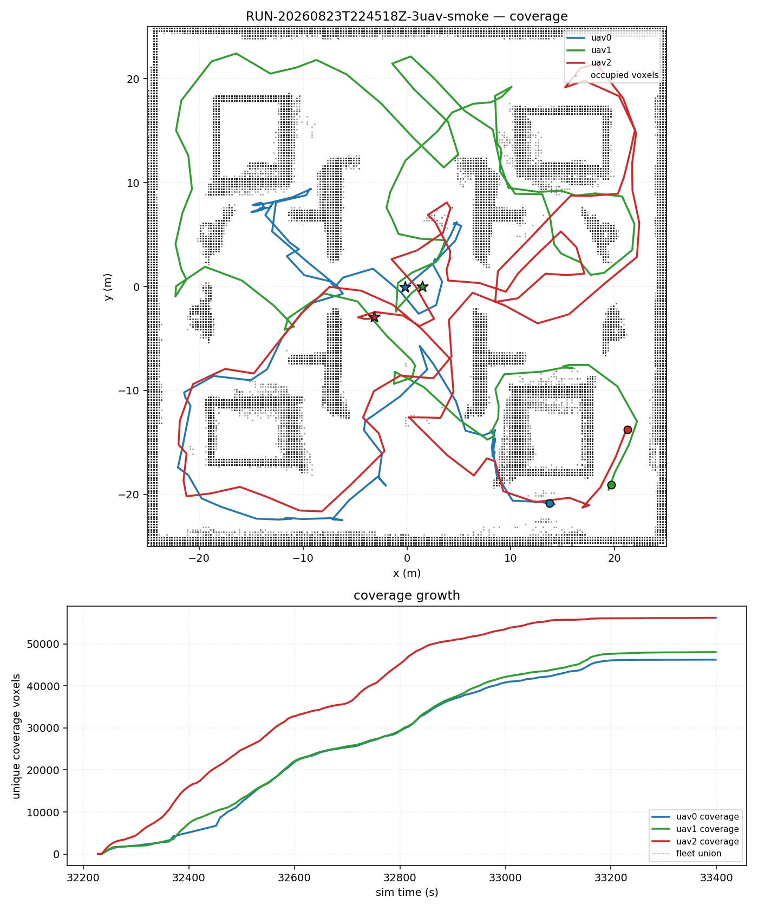
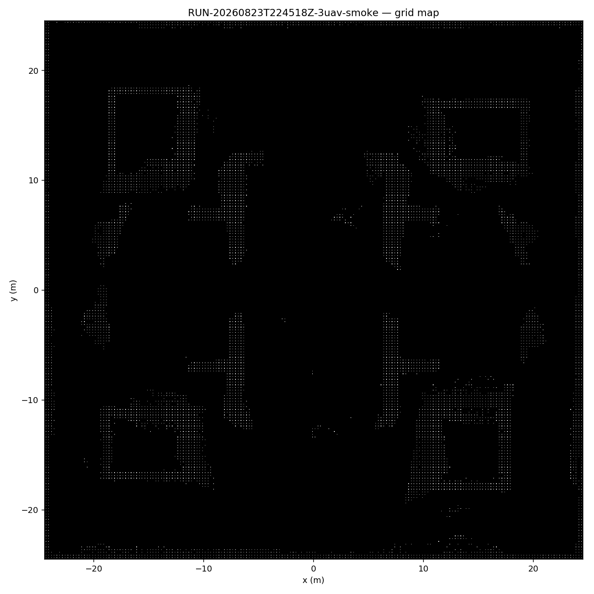
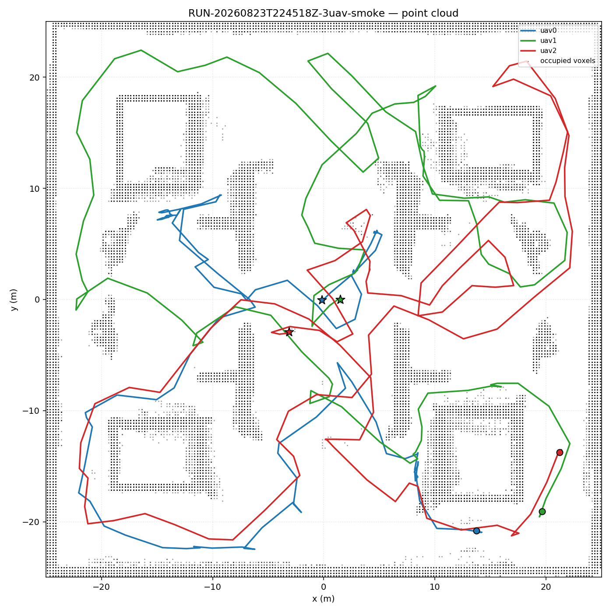
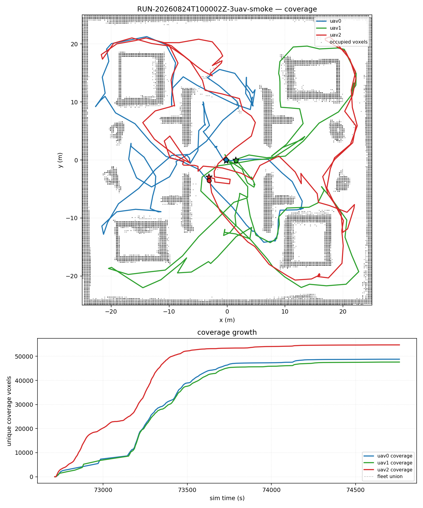
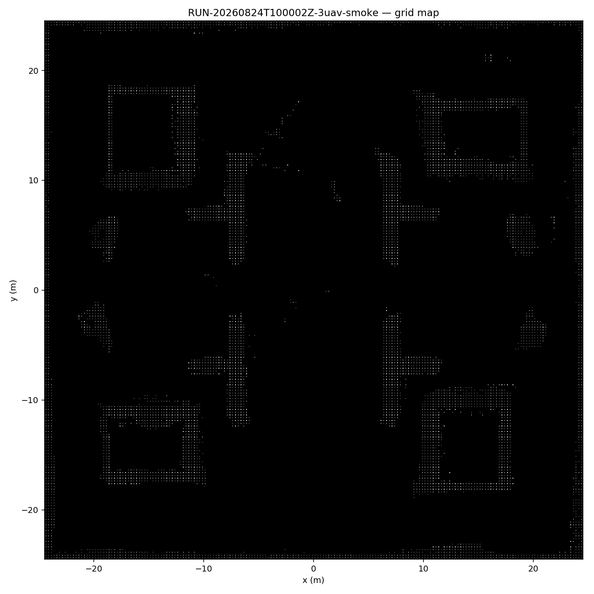
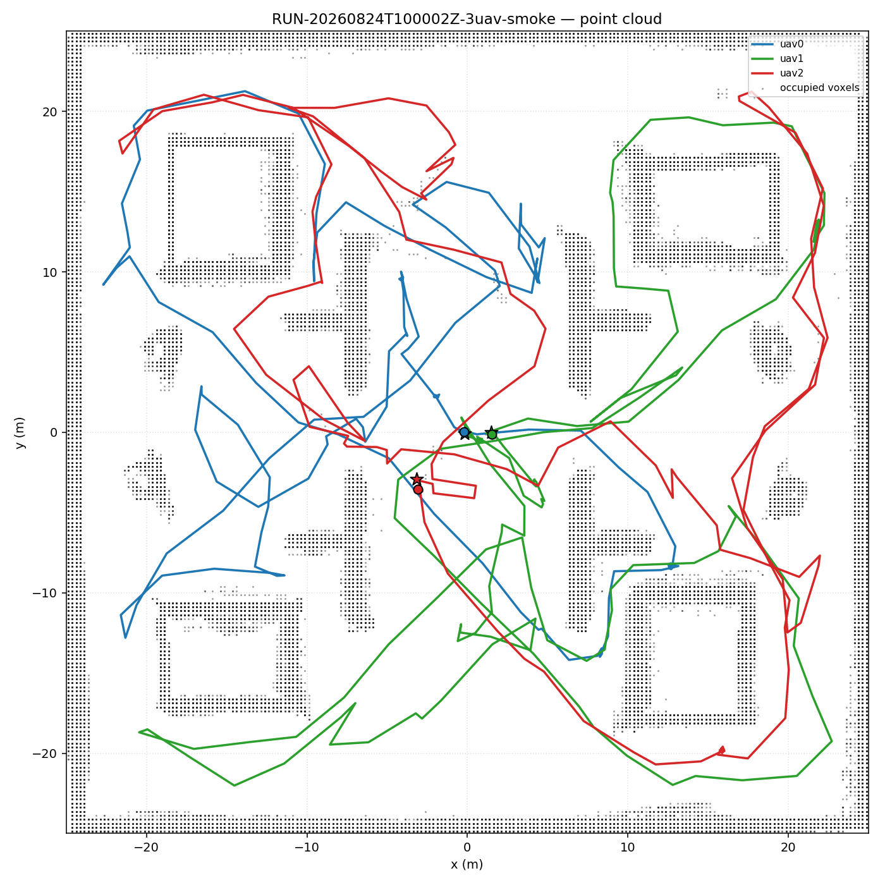
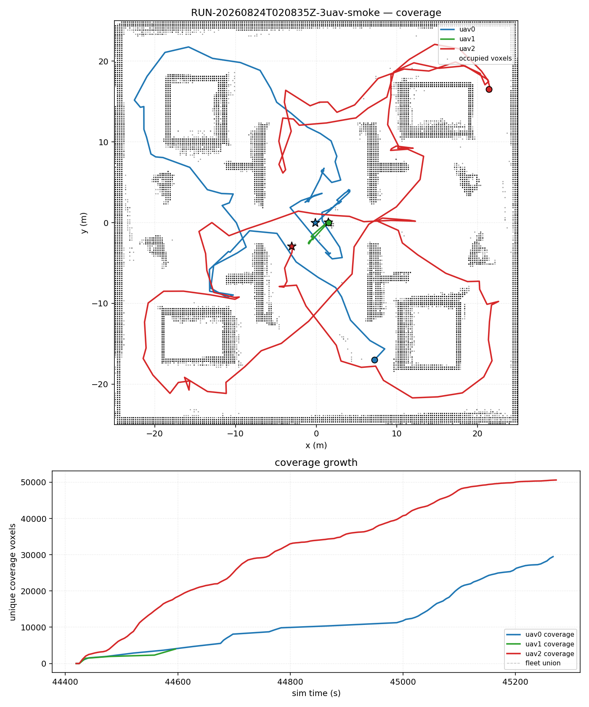
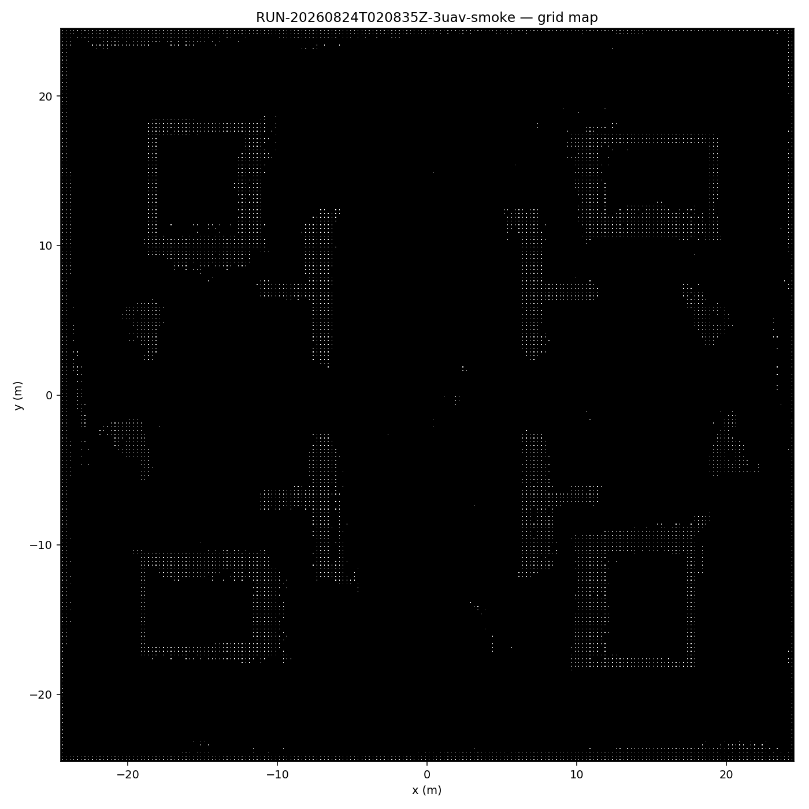
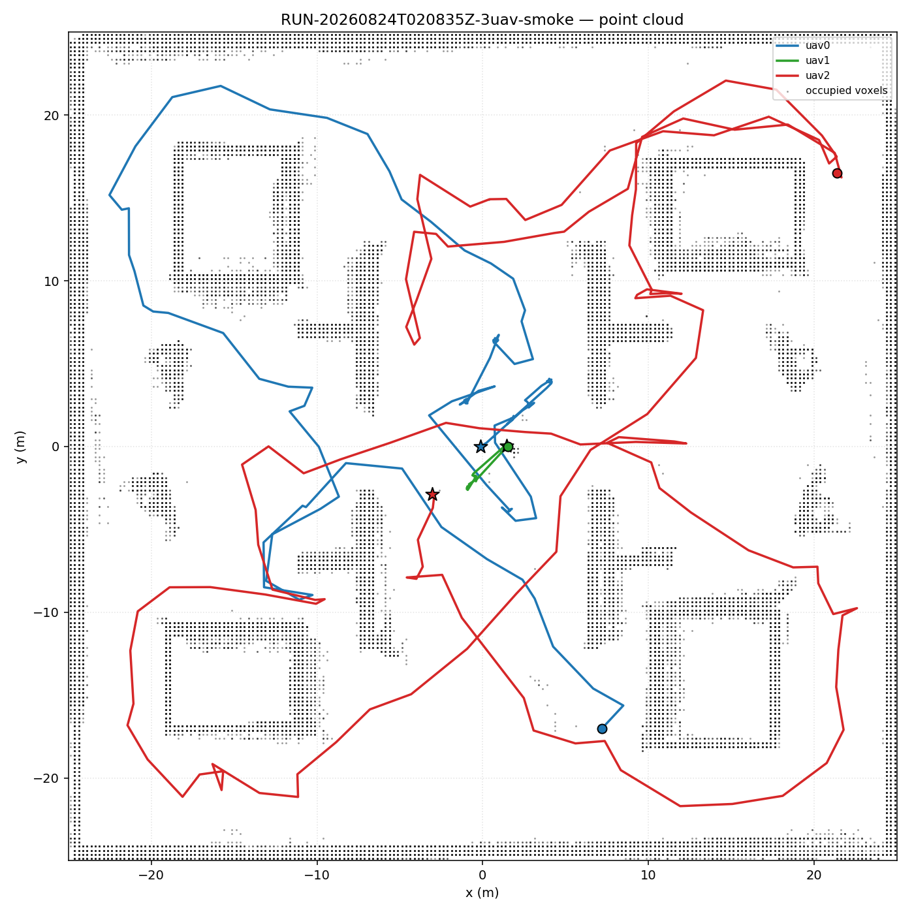

# P0 阶段总结：多机负载均衡 300s 矩阵收尾

> 阶段：负载均衡矩阵收尾（P0）
> 时间：2026-08-24
> 状态：**21/21 全部 done（18 矩阵 + C1 最终验证 3 runs）**
> 汇总人：sol（高终端）· 数据来源：`experiments/matrix_results.jsonl`、`matrix_state.json`

---

## 1. 矩阵最终成绩（6 组 × 3 次 = 18 runs + C1 验证 3 runs，每组 300 sim-s）

### 1.1 总览

- **21/21 done，0 failed**（A2-r3 重跑成功、C1-r1 重跑成功、C1-r3 完成）
- 18/18 矩阵无 crash、无 contact；9/9 掉线 run 全部 `intentional_dropout` 分类正确
- **C1 最终验证（MINMAX+0.75 无掉线 ×3）全部通过**
- 修复了 runner `monitor_until` 的 sim-time 探测死循环（见 §4），C1-r1/r3 在
  sim≈326–331s 正常触发 `duration_complete`（修复前 C1-r2 卡到 608s 不结束）

### 1.2 分组统计（均值 ± 标准差，仅 done run）

| 组 | 配置 | n | fleet ratio | 总路径 m | 失衡比 | Jaccard | overlap |
|---|---|:---:|---:|---:|---:|---:|---:|
| A1 | MINSUM 0.75 | 3 | 0.205±0.025 | 557±174 | 2.41±1.03 | 0.657±0.128 | 0.902±0.030 |
| A2 | MINMAX 0.75 | 3 | 0.224±0.007 | 796±88 | 1.43±0.20 | 0.741±0.032 | 0.898±0.015 |
| A3 | MINMAX 0.50 | 3 | 0.213±0.009 | 709±109 | 2.11±1.30 | 0.745±0.011 | 0.877±0.013 |
| B1 | MINSUM 0.75 + drop | 3 | 0.201±0.019 | 503±55 | 7.36±1.28 | 0.141±0.037 | 0.893±0.028 |
| B2 | MINMAX 0.75 + drop | 3 | 0.207±0.008 | 562±34 | 9.08±3.38 | 0.080±0.009 | 0.911±0.008 |
| B3 | MINMAX 0.50 + drop | 3 | 0.185±0.023 | 427±72 | 6.41±2.65 | 0.260±0.189 | 0.897±0.026 |
| **C1** | **MINMAX 0.75（最终验证）** | **3** | **0.226±0.005** | **819±143** | **1.10±0.02** | **0.761±0.024** | 0.894±0.013 |

> **C1 = 全矩阵最优配置**：fleet ratio 0.226 最高、失衡比 1.10 最低（最均衡）、
> Jaccard 0.761 高（地图一致性）。MINMAX+0.75 三重复现一致（ratio 0.222–0.232）。

### 1.3 C1 组逐 run

| run | runroot | exit | safety | ratio | 失衡比 | Jaccard | abort |
|---|---|---|---|---:|---:|---:|---|
| C1-r1 | RUN-20260824T110657Z | duration_complete | True | 0.2316 | 1.09 | 0.7792 | [] |
| C1-r2 | RUN-20260824T100002Z | duration_complete* | True* | 0.2233 | 1.13 | 0.7700 | [] |
| C1-r3 | RUN-20260824T112459Z | duration_complete | True | 0.2226 | 1.09 | 0.7343 | [] |

> *C1-r2 为修复前 run：数据完整（sim 608s）但 runner 未自动触发 duration，
> 人工 stop 收尾；台账按 done 记录并注明。C1-r1/r3 为修复后重跑，正常自动结束。

### 1.4 A2-r3 重跑（18/18 矩阵闭环）—— runroot 已加 `-A2-r3` 后缀

| 项 | 值 |
|---|---|
| runroot | `results/RUN-20260824T092806Z-3uav-smoke-A2-r3/` |
| exit / safety | `duration_complete` / `final_safety_passed=true` |
| fleet ratio | 0.2274（组内最高） |
| 失衡比 | 1.58（350.4 / 324.7 / 222.2 m，total 897.2 m） |
| Jaccard / overlap | 0.775 / 0.8995 |
| abort | `[]` |
| sim 时长 | 327.3 sim-s（RT p95=0.37） |

---

## 2. 主要结论

1. **MINMAX 均衡性成立（H1 ✓）**：无掉线组 A2 失衡比 1.43 显著低于 A1（MINSUM）的 2.41，
   路径更均衡，代价是总路径更长（796 vs 557 m）。
2. **掉线是负载集中的主因（H3 ✓）**：B 组失衡比 6.4–9.1 vs A 组 1.4–2.4；
   掉线机地图贡献丢失导致 Jaccard 骤降（0.08–0.26 vs 0.66–0.75）。
3. **掉线鲁棒性成立（H3 ✓）**：9/9 掉线 run 剩余机 coverage delta 全部 > 0，无 abort/crash。
4. **300s 覆盖提升（H4 部分 ✓）**：fleet ratio 0.19–0.23 vs 120s 的 0.115，但未收敛到完整搜图。
5. **最终配置 = MINMAX + 0.75（C1 三重复现确认）**：C1 组 ratio 0.226±0.005、
   失衡比 1.10±0.02、Jaccard 0.761±0.024，为全矩阵最优且高度稳定。

---

## 3. 图件证据（每 run 自动产出，均已按真实建图标准重绘）

### 3.1 A2 组代表（MINMAX+0.75，无掉线）—— `RUN-20260823T224518Z`（A2-r2）







### 3.2 A2-r3 重跑（18/18 闭环）—— `RUN-20260824T092806Z`


### 3.3 C1-r2 最终配置验证 —— `RUN-20260824T100002Z`







### 3.4 B 组代表（掉线 uav1@60s node_level）—— `RUN-20260824T020835Z`（B2-r1）







---

## 4. 阶段结论与边界

### 结论

- P0 负载均衡矩阵**正式闭环**：21/21 done，A/B 假设全部验证，C1 最终配置验证
  三重复现完成（MINMAX+0.75 确认为最优配置）。
- 掉线鲁棒性 + MINMAX 均衡性两项赛题相关核心结论已具备完整证据链。

### 边界与遗留

- **runner 缺陷（已修复）**：`sim_time_s()` 探测失败时 `monitor_until` 原先进入
  `sleep(1); continue` 死循环，duration 检查被跳过，直到 wall_deadline（3000s）
  才 timeout。影响：C1-r2 跑到 sim 608.7s 未自动停止。
  **修复**（`two_uav_runner.py`）：`sim_time_s` 失败降级为读取
  `fleet/telemetry.jsonl` 的 `clock.last_sim_s`；双源连续失败
  `SIM_PROBE_CONSECUTIVE_FAIL_LIMIT` 次则返回 `sim_time_probe_stall`，不再无限循环。
  self-test 新增两用例覆盖 fallback 与 stall 路径，全部通过。
  验证：C1-r1（sim 326s）/C1-r3（sim 331s）均正常自动触发 `duration_complete`。
- **hash 重签**：因修改 runner，`config/3uav_source_hashes.sha256` 中
  `scripts/two_uav_runner.py` 一行已更新为新 hash，approval 由执行器自动重签。
- 覆盖率未收敛到完整搜图（50×50 m 地图 300s 不够），赛题 H4 仅部分成立；
  是否延长时长作为 P1 之后的可选项。
- 台账口径：C1-r2 按 done 记录（注明 duration 未自动触发，修复前 run）。

---

## 5. 下一步唯一动作

```text
1. 收尾 commit：stage: LB-matrix closeout（21/21 done，含 runner 修复）（高终端审核后提交）。
2. P1 阶段策划（延长时长/更大地图等）由人工在后续会话启动。
```

> 新会话首读：`AGENTS.md`、`handoff/TERMINAL_HANDOFF_PROTOCOL.md`、
> `state/current_summary.md`、`state/SESSION_HANDOFF.md`、
> `experiments/PLAN_COMPETITION_2026.md`、`experiments/P0_LOAD_BALANCING_CLOSEOUT.md`。
