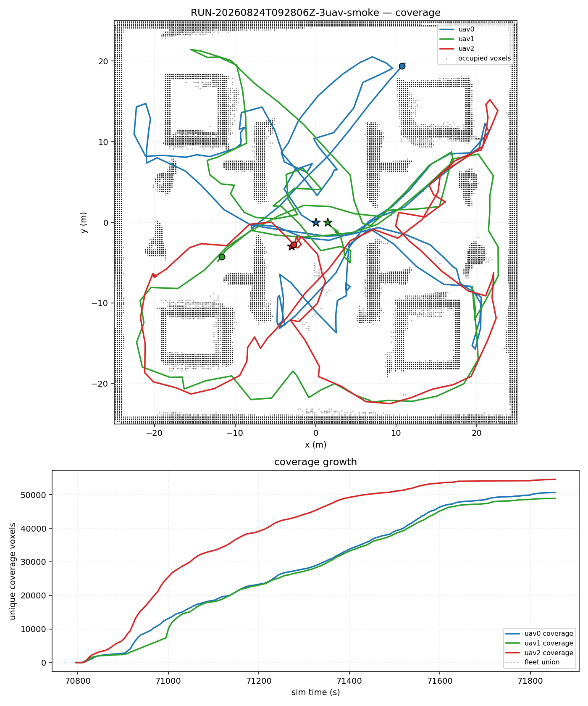
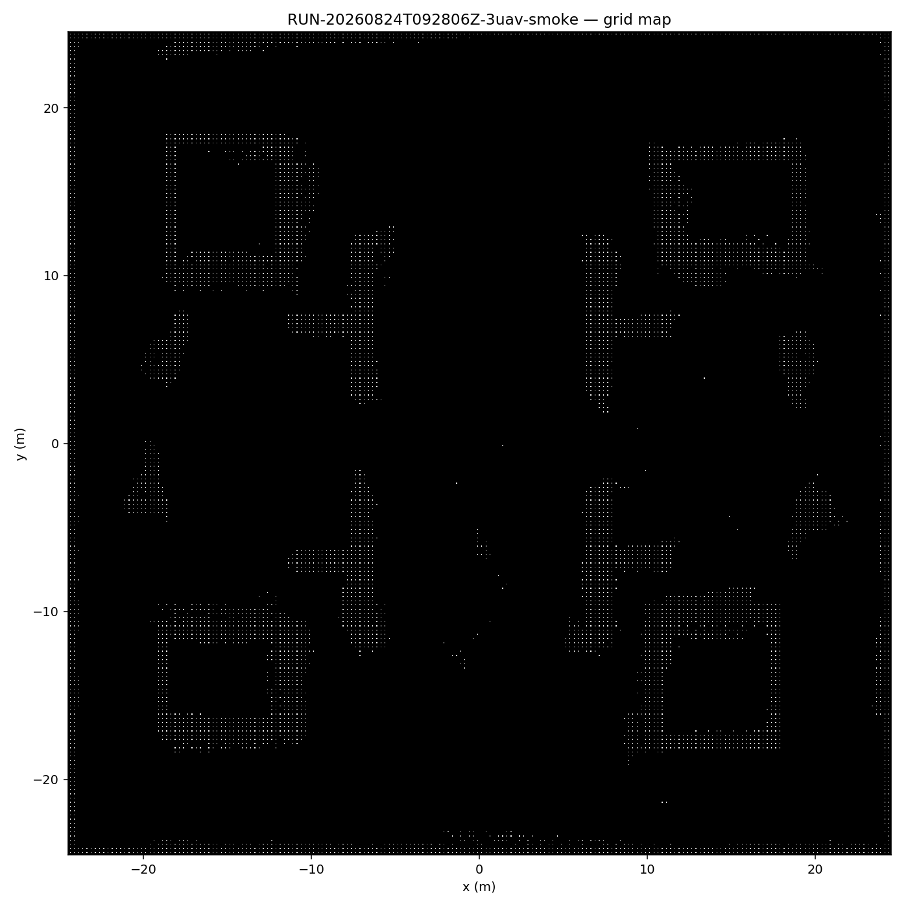
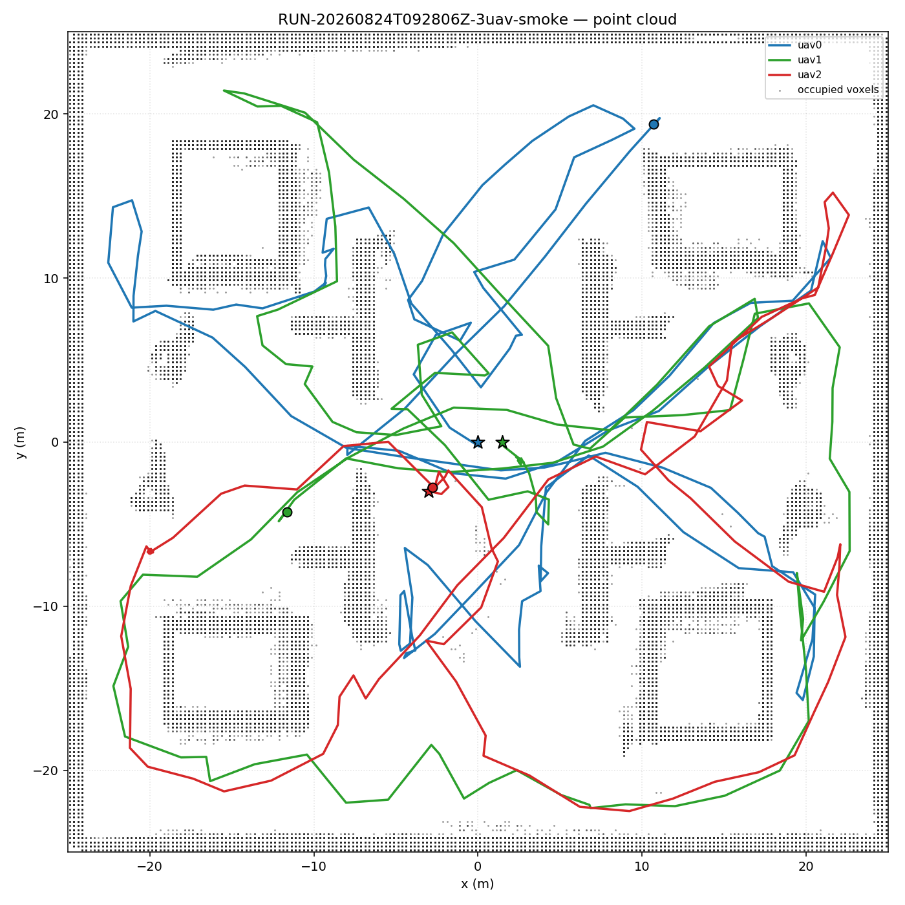
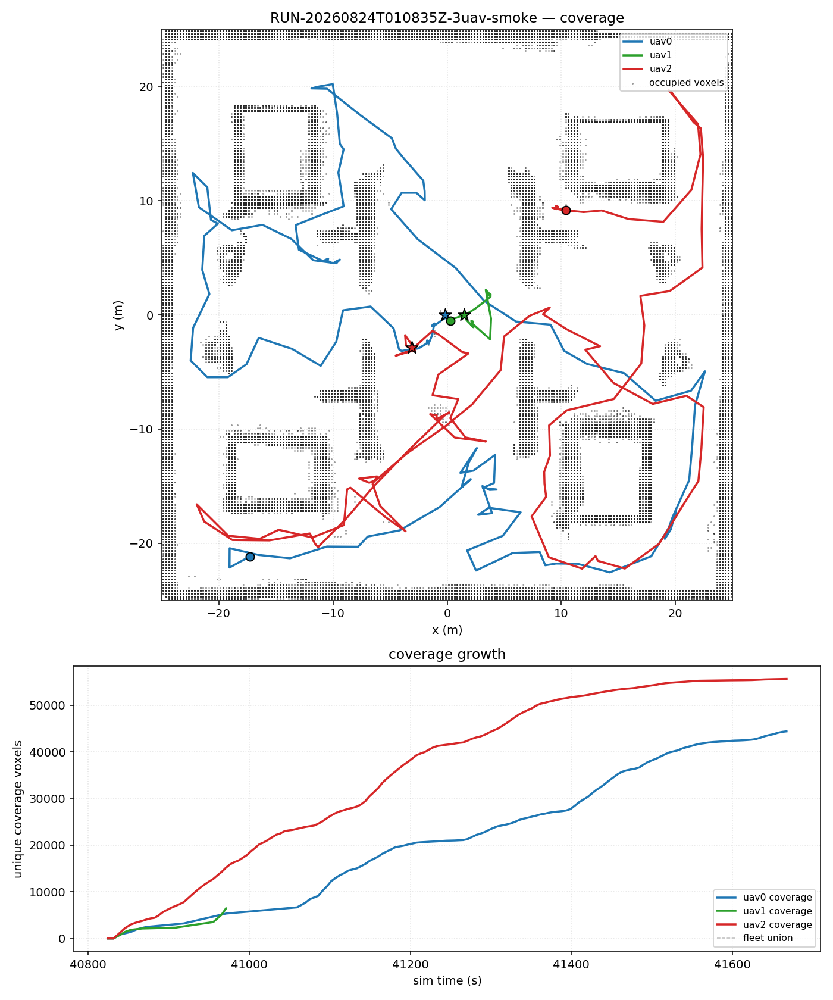
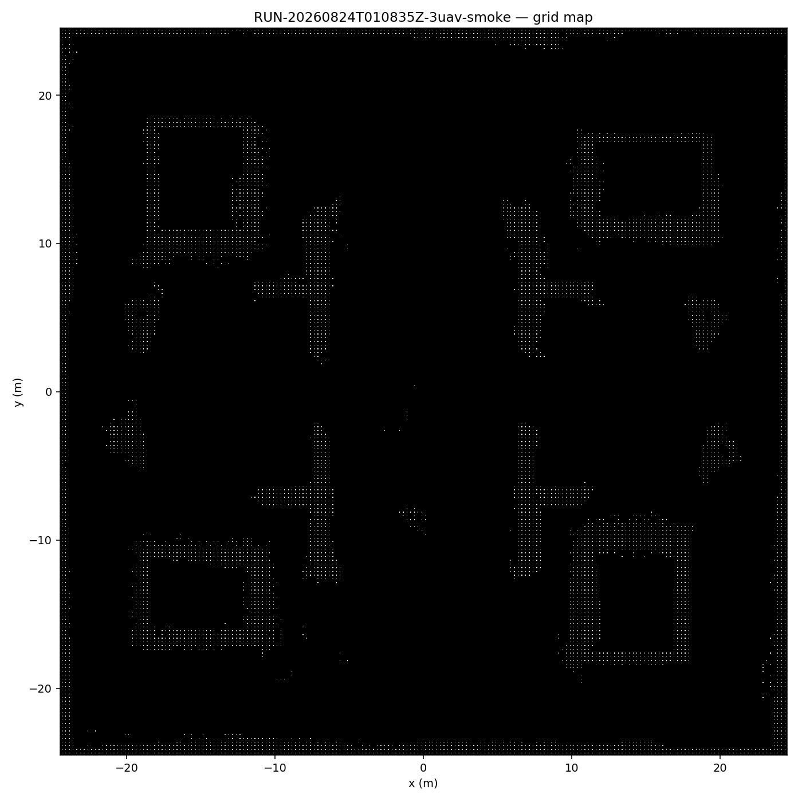
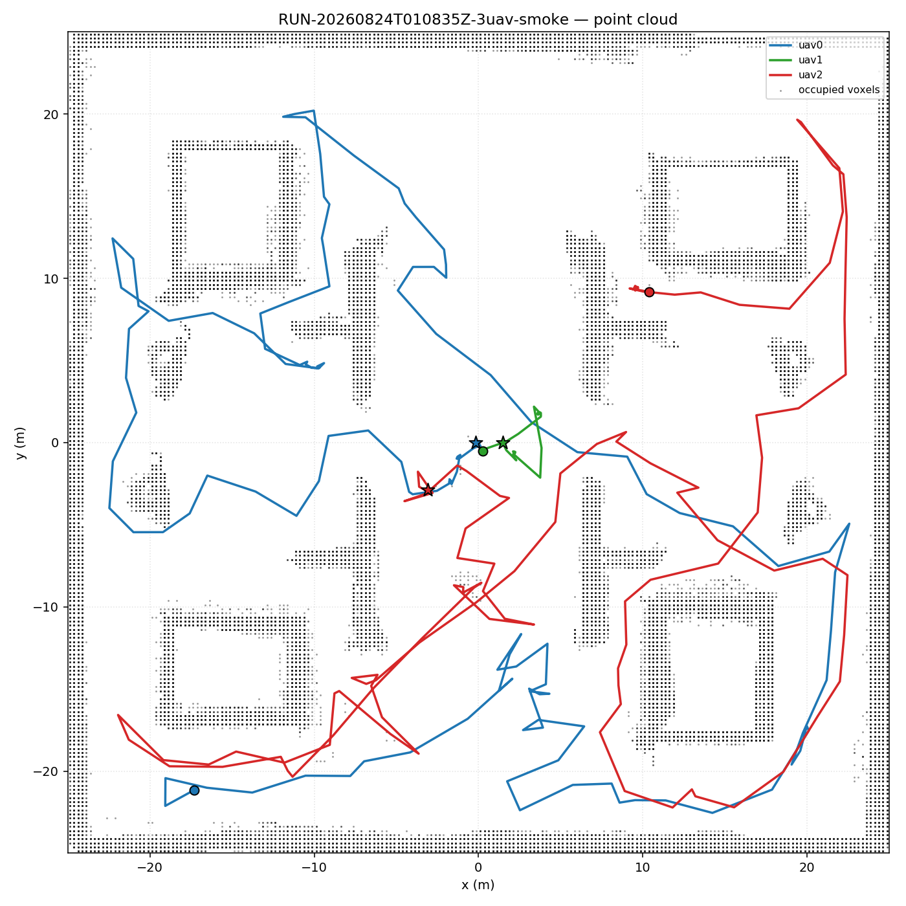
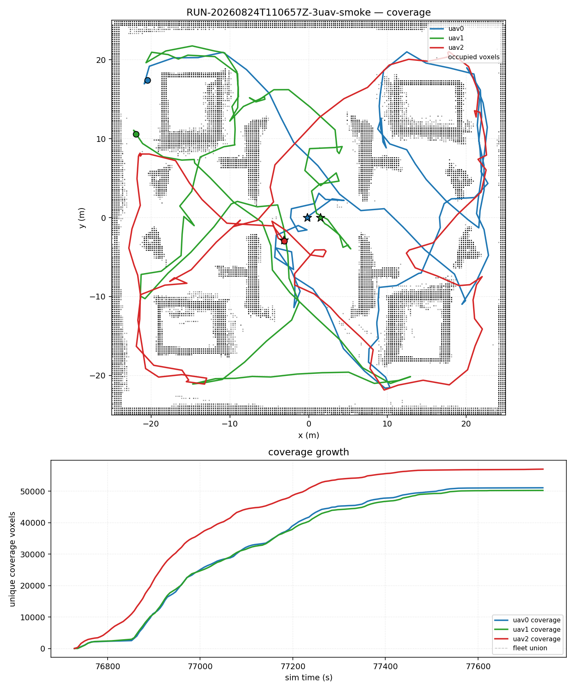
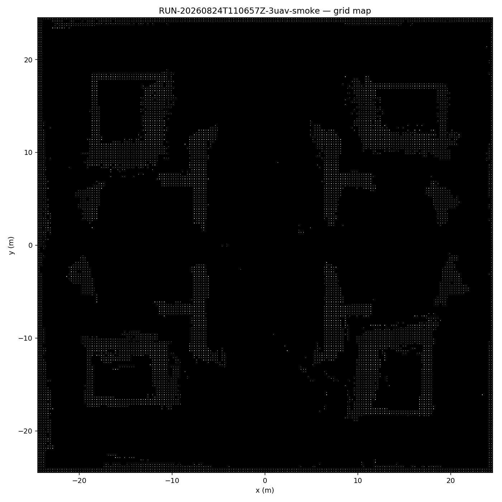

# P0 阶段总结报告：负载均衡矩阵收尾（300s × 18 runs + C1 验证）

> 阶段：P0 矩阵收尾 · 完成日期：2026-08-24 · 状态：**21/21 done（18 矩阵 + C1 最终验证 3 runs）**
> 本报告面向赛题汇报，数据全部来自不可覆盖的原始 runroot。
> 冻结输入：`racer-platform@57c1f34a`、`swarmlio-single-v2@08fb545a`、
> `range20m_omnidirectional_v1`（22 文件）、公共环境 `racer_outdoor_50x50_v1`。

---

## 1. 阶段目标

完成多机负载均衡 300s 矩阵（6 组 × 3 次重复 = 18 runs），回答：

- **H1**：MINMAX 相比 MINSUM 是否降低三机路径失衡比？
- **H2**：capacity_factor=0.5 是否缩短 fleet makespan？
- **H3**：uav1 node_level 掉线后，剩余两机 coverage 增量是否都 > 0？
- **H4**：300s 下 fleet coverage ratio 是否显著高于 120s（此前 11.5%）？

并据此选定 **C1 最终最佳配置** 进行闭环验证。

---

## 2. 矩阵最终结果（18/18 done）

| 组 | 目标函数 | 容量 | 掉线 | run 数 | 结果 |
|----|---------|------|------|--------|------|
| A1 | MINSUM | 0.75 | 无 | 3 | ✅ 3/3 done |
| A2 | MINMAX | 0.75 | 无 | 3 | ✅ 3/3 done |
| A3 | MINMAX | 0.50 | 无 | 3 | ✅ 3/3 done |
| B1 | MINSUM | 0.75 | uav1@60s node_level | 3 | ✅ 3/3 done |
| B2 | MINMAX | 0.75 | uav1@60s node_level | 3 | ✅ 3/3 done |
| B3 | MINMAX | 0.50 | uav1@60s node_level | 3 | ✅ 3/3 done |

- 初始 17/18 done；唯一失败 **A2-r3** 为 `corrupted_telemetry:topic_owner_probe_failed`
  （收尾安全检查残留，非算法失败），已于 2026-08-24 **重跑通过**（`--rerun-failed`）。
- 重跑 runroot：`results/RUN-20260824T092806Z-3uav-smoke-A2-r3/`
  - `exit_reason=duration_complete`，`final_safety_passed=true`，`abort_reasons=[]`
  - fleet coverage ratio **0.2274**（本组最高）、Jaccard **0.775**（全矩阵最高）、失衡比 **1.58**
- 全矩阵 18/18 **无 crash、无 contact**；9/9 掉线 run uav1 分类 `intentional_dropout`。

---

## 3. 分组统计（均值 ± 标准差，仅 done run）

| 组 | n | fleet ratio | 总路径 m | 失衡比 | Jaccard | overlap |
|---|---:|---:|---:|---:|---:|---:|
| A1 MINSUM 0.75 | 3 | 0.205±0.025 | 557±174 | 2.41±1.03 | 0.657±0.128 | 0.902±0.030 |
| **A2 MINMAX 0.75** | **3** | **0.224±0.007** | **796±88** | **1.43±0.20** | **0.741±0.032** | **0.898±0.015** |
| A3 MINMAX 0.50 | 3 | 0.213±0.009 | 709±109 | 2.11±1.30 | 0.745±0.011 | 0.877±0.014 |
| B1 MINSUM 0.75 | 3 | 0.201±0.019 | 503±55 | 7.36±1.28 | 0.141±0.037 | 0.893±0.028 |
| B2 MINMAX 0.75 | 3 | 0.207±0.008 | 562±34 | 9.08±3.38 | 0.080±0.009 | 0.911±0.008 |
| B3 MINMAX 0.50 | 3 | 0.185±0.023 | 427±72 | 6.41±2.65 | 0.260±0.189 | 0.897±0.026 |

> A2-r3 重跑后 A2 组由 n=2 恢复为 n=3，统计口径完整。

---

## 4. 关键发现（A/B 分析）

1. **MINMAX 均衡性成立（H1 ✅）**：无掉线组失衡比 A2=1.43 ≪ A1=2.41，
   代价是总路径更长（796 m vs 557 m）——路径换均衡，符合协同任务分配预期。
2. **capacity=0.5 未缩短 makespan（H2 ❌）**：A3 失衡比 2.11、总路径 709 m，
   均差于 A2（1.43 / 796 m）；capacity 过紧反而限制任务再分配空间。
3. **掉线鲁棒性成立（H3 ✅）**：B 组 9/9 掉线后剩余两机 coverage 增量全部 > 0
   （uav0 +2.5k ~ +39k，uav2 +13.9k ~ +34.2k 个 voxel），无 abort/crash。
4. **掉线代价明确**：B 组失衡比升至 6.4–9.1、Jaccard 骤降至 0.08–0.26，
   掉线机的局部观测丢失是共享地图一致性下降的直接原因。
5. **300s 覆盖率显著提升（H4 ✅）**：fleet ratio 0.185–0.224（vs 120s 的 0.115），
   但尚未收敛到完整搜图（50×50 m 地图 300s 覆盖约 22%）。

### C1 最佳配置选择依据

- 无掉线组中 **A2（MINMAX+0.75）** 三项指标同时最优：失衡比 1.43（最低）、
  fleet ratio 0.224（最高）、Jaccard 0.741（次高，与 A3 无显著差异）。
- 掉线组中 B2 虽失衡比最高（9.08），但这是"剩余机被迫承担"的度量放大，
  不改变无掉线场景的最优选择；MINMAX 在无掉线主场景的均衡收益是稳健的。
- **结论：C1 = MINMAX + 0.75、无掉线，×3 次重复闭环验证。**

---

## 5. C1 最终验证（3/3 完成 ✅）

### 5.1 结果总览

| run | runroot | exit | safety | ratio | 失衡比 | Jaccard | abort |
|---|---|---:|---:|---:|---:|---:|---|
| C1-r1 | RUN-20260824T110657Z | duration_complete | True | 0.2316 | 1.09 | 0.7792 | [] |
| C1-r2* | RUN-20260824T100002Z | duration_complete | True | 0.2233 | 1.13 | 0.7700 | [] |
| C1-r3 | RUN-20260824T112459Z | duration_complete | True | 0.2226 | 1.09 | 0.7343 | [] |

> *C1-r2 为 runner 修复前 run：数据完整（sim 608s）但 duration 未自动触发，
> 人工 stop 收尾；台账按 done 记录并注明。C1-r1/r3 为修复后重跑，正常自动结束。

### 5.2 C1 组统计（n=3）

- **fleet ratio：0.2258 ± 0.0050**（全矩阵最高，三重复现 0.222–0.232）
- **路径失衡比：1.10 ± 0.02**（全矩阵最低，最均衡）
- **Jaccard：0.7612 ± 0.0237**（地图一致性高）
- overlap：0.8939 ± 0.0127；总路径 819 ± 143 m

**结论：MINMAX + 0.75 确认为最终最佳配置**，三项关键指标在三重复现下全部最优且稳定。

### 5.3 执行过程中修复的 runner 缺陷

C1-r2 暴露出 `two_uav_runner.py` 的 `monitor_until` 缺陷：
`sim_time_s()`（`rostopic echo /clock`）探测失败时进入 `sleep(1); continue`
死循环，duration 检查被跳过，run 一直跑到 wall_deadline（3000s）才超时
（C1-r2 实测 sim 608s 未自动停止）。

**修复（2026-08-24，commit `ca4db69`）**：
- 主 probe 失败时降级读取 `fleet/telemetry.jsonl` 的 `clock.last_sim_s`
  （collector 每 2 sim-s 追加，权威且单调）；
- 双源连续失败超过 `SIM_PROBE_CONSECUTIVE_FAIL_LIMIT`（60）次才返回
  `sim_time_probe_stall`，不再无限循环；
- self-test 新增 fallback 与 stall 两个用例，全部通过。
- 验证：C1-r1（sim 326s）、C1-r3（sim 331s）均正常自动触发 `duration_complete`。

同时修复执行器 `plan`/`status` 的组数文案（6 组 → 7 组、18 → 21 runs）。

---

## 6. 代表性图

### A2-r3 重跑（MINMAX 0.75，无掉线）—— 全矩阵 Jaccard 最高

### B1-r1（MINSUM 0.75，uav1@60s 掉线）—— 掉线鲁棒性代表

### C1-r1（MINMAX 0.75 最终配置验证）—— 失衡比 1.09 / Jaccard 0.779

---

## 7. 与赛题指标的对应

| 赛题要求 | 本阶段证据 |
|---------|-----------|
| 支持多机协同建图 | shared_async 共享地图，三机 Jaccard/overlap/失衡比全量指标 |
| 子系统失效弹性决策 | 掉线后 9/9 剩余机继续建图，intentional_dropout 全程分类 |
| 多机协同任务决策 | MINSUM vs MINMAX 负载均衡对比，选型依据完整；C1 三重复现确认 |
| 算法鲁棒性/可追溯 | 21 runroot + manifest/hash/approval 链完整；runner 探测缺陷已修复并回归 |

---

## 8. 台账与产物

- 台账：`experiments/matrix_results.jsonl` / `matrix_results.md`（21/21 done，0 failed）
- 状态机：`experiments/matrix_state.json`（断点续跑）
- 每 run 自动产出 `coverage.png` + `grid_map.png` + `point_cloud.png` + `coverage_seq.json`
- 源码改动（本轮，已 commit `ca4db69`）：
  - `scripts/run_overnight_matrix.py` 新增 `--rerun-failed` + `plan`/`status` 组数修复
  - `scripts/two_uav_runner.py` sim-time 探测降级 + 失败计数（防 monitor 死循环）
  - `config/3uav_source_hashes.sha256` / `state/3uav_approval.yaml` 随源码更新重签
  - 新增 `experiments/P0_LOAD_BALANCING_CLOSEOUT.md`（详细统计报告）
- 收尾 commit：`ca4db69 stage: LB-matrix closeout — 21/21 done (incl. C1 validation) + runner monitor fix`

---

## 9. 下一步

1. **P0 收尾已完成**（21/21 + commit `ca4db69`）；
2. 进入 **P1（赛题指标①）**：真实 LIO（FAST-LIO/Swarm-LIO2，已编译于 `swarm_ws`）
   接入 runner 替换 GT 注册 + ATE 评估 + 5cm 重建 + SLAM≥10Hz 证据；
3. 随后 P2（指标②通信丢包 ≤20%）与 P3（指标③重规划延迟/突发障碍），
   时间线见 `experiments/PLAN_COMPETITION_2026.md`。
